# Architecture Overview

This document provides a high-level overview of the Runbook-Synthesizer architecture.
For detailed design decisions and specifications, see [DESIGN.md](DESIGN.md).

## System Architecture

```mermaid
flowchart TB
    subgraph Ingestion["📥 Alert Ingestion"]
        ALARMS[OCI Monitoring Alarms]
        WEBHOOK[Webhook Endpoint]
    end

    subgraph ContextEnrichment["🔍 Context Enrichment"]
        OCIMON[OCI Monitoring API]
        OCILOG[OCI Logging]
        PROM[Prometheus]
    end

    subgraph RAGPipeline["🧠 RAG Pipeline"]
        EMBEDDER[Embedding Service]
        VECTORDB[(Oracle 23ai<br>Vector Store)]
        GENERATOR[LLM Provider]
    end

    subgraph Output["📋 Output"]
        API[REST API]
        WEBHOOKS[Webhooks]
    end

    ALARMS --> WEBHOOK --> ContextEnrichment --> RAGPipeline --> Output
```



## Package Structure

```text
com.oracle.runbook/
├── domain/       # Pure domain models (Alert, EnrichedContext, DynamicChecklist)
├── ingestion/    # Alert source adapters
├── enrichment/   # Context enrichment (OCI, Prometheus, Loki)
├── rag/          # RAG pipeline (embeddings, retrieval, generation)
├── api/          # REST resources (Helidon handlers)
├── output/       # Webhook destinations (Slack, PagerDuty)
└── config/       # Application configuration
```

## Cloud Provider Abstraction

The application supports multiple cloud providers through a pluggable adapter architecture. This enables deployment on both Oracle Cloud Infrastructure (OCI) and Amazon Web Services (AWS) without code changes.

### Supported Providers

| Provider | Storage        | Compute Metadata | Metrics    | Logs            |
|----------|----------------|------------------|------------|------------------|
| **OCI**  | Object Storage | Compute API      | Monitoring | Logging          |
| **AWS**  | S3             | EC2              | CloudWatch | CloudWatch Logs  |

### Adapter Architecture


### Cloud Package Organization

```text
com.oracle.runbook.infrastructure.cloud/
├── CloudConfig.java              # Base interface for cloud configuration
├── CloudStorageAdapter.java      # Interface for runbook storage
├── ComputeMetadataAdapter.java   # Interface for instance metadata
├── CloudAdapterFactory.java      # Factory for creating adapters
├── oci/
│   ├── OciConfig.java            # OCI-specific configuration
│   ├── OciObjectStorageAdapter.java
│   ├── OciComputeMetadataAdapter.java
│   └── OciAuthProviderFactory.java
└── aws/
    ├── AwsConfig.java            # AWS-specific configuration
    ├── AwsS3StorageAdapter.java
    ├── AwsEc2MetadataAdapter.java
    ├── AwsCloudWatchMetricsAdapter.java
    └── AwsCloudWatchLogsAdapter.java
```

### Provider Selection

The active cloud provider is selected via the `cloud.provider` configuration property:

```yaml
# application.yaml
cloud:
  provider: aws  # or "oci"
```

The `CloudAdapterFactory` reads this configuration and instantiates the appropriate adapters at startup.

### Configuration Examples

**AWS Configuration:**

```yaml
cloud:
  provider: aws
  aws:
    region: us-east-1
    storage:
      bucket: runbook-synthesizer-runbooks
```

**OCI Configuration:**

```yaml
cloud:
  provider: oci
  oci:
    region: us-ashburn-1
    compartmentId: ${OCI_COMPARTMENT_ID}
    storage:
      namespace: ${OCI_NAMESPACE}
      bucket: runbook-synthesizer-runbooks
```

---

## Key Design Decisions

1. **Helidon SE 4.x** - Oracle's native microframework with virtual threads
2. **Hexagonal Architecture** - Clean separation between domain and infrastructure
3. **Pluggable LLM Interface** - Swap between OCI GenAI, OpenAI, or Ollama
4. **Multi-Cloud Storage** - Runbooks stored as markdown in OCI Object Storage or AWS S3
5. **Multi-source Observability** - Support for OCI + AWS CloudWatch + Prometheus + Loki
6. **Cloud Provider Abstraction** - Pluggable adapters for OCI and AWS cloud services
