# Architecture Overview

This document provides a high-level overview of the Runbook-Synthesizer architecture.
For detailed design decisions and specifications, see [DESIGN.md](DESIGN.md).

## System Architecture

```mermaid
flowchart TB
    subgraph Ingestion["📥 Alert Ingestion"]
        ALARMS[OCI Monitoring Alarms]
        WEBHOOK[Webhook Endpoint]
    end

    subgraph ContextEnrichment["🔍 Context Enrichment"]
        OCIMON[OCI Monitoring API]
        OCILOG[OCI Logging]
        PROM[Prometheus]
    end

    subgraph RAGPipeline["🧠 RAG Pipeline"]
        EMBEDDER[Embedding Service]
        VECTORDB[(Oracle 23ai<br>Vector Store)]
        GENERATOR[LLM Provider]
    end

    subgraph Output["📋 Output"]
        API[REST API]
        WEBHOOKS[Webhooks]
    end

    ALARMS --> WEBHOOK --> ContextEnrichment --> RAGPipeline --> Output
```



## Package Structure

```text
com.oracle.runbook/
├── domain/       # Pure domain models (Alert, EnrichedContext, DynamicChecklist)
├── ingestion/    # Alert source adapters
├── enrichment/   # Context enrichment (OCI, Prometheus, Loki)
├── rag/          # RAG pipeline (embeddings, retrieval, generation)
├── api/          # REST resources (Helidon handlers)
├── output/       # Webhook destinations (Slack, PagerDuty)
└── config/       # Application configuration
```

## Cloud Provider Abstraction

The application supports multiple cloud providers through a pluggable adapter architecture. This enables deployment on both Oracle Cloud Infrastructure (OCI) and Amazon Web Services (AWS) without code changes.

### Supported Providers

> **Note**: AWS is the default cloud provider. OCI is supported as an alternative.

| Provider | Storage        | Compute Metadata | Metrics    | Logs            | Alerts             | LLM                |
|----------|----------------|------------------|------------|------------------|--------------------|--------------------||
| **AWS** (default) | S3    | EC2              | CloudWatch | CloudWatch Logs  | SNS/CloudWatch     | Bedrock (Claude/Cohere) |
| **OCI**  | Object Storage | Compute API      | Monitoring | Logging          | —                  | —                  |

### Adapter Architecture

```mermaid
flowchart LR
    subgraph Factory["🏭 Factory"]
        CloudAdapterFactory
    end

    subgraph Interfaces["📋 Interfaces"]
        CloudConfig
        CloudStorageAdapter
        ComputeMetadataAdapter
        MetricsSourceAdapter
        LogSourceAdapter
        AlertSourceAdapter
        LlmProvider
    end

    subgraph OCI["☁️ OCI Implementations"]
        OciConfig
        OciObjectStorageAdapter
        OciComputeMetadataAdapter
        OciMonitoringAdapter
        OciLoggingAdapter
    end

    subgraph AWS["🌐 AWS Implementations (Default)"]
        AwsConfig
        AwsS3StorageAdapter
        AwsEc2MetadataAdapter
        AwsCloudWatchMetricsAdapter
        AwsCloudWatchLogsAdapter
        AwsSnsAlertSourceAdapter
        AwsBedrockLlmProvider
    end

    subgraph LLM["🧠 LLM Providers"]
        OllamaLlmProvider["OllamaLlmProvider (MVP)"]
        AwsBedrockLlmProvider2["AwsBedrockLlmProvider (Prod)"]
    end

    CloudAdapterFactory -->|creates| OCI
    CloudAdapterFactory -->|creates| AWS

    OciConfig -.->|implements| CloudConfig
    OciObjectStorageAdapter -.->|implements| CloudStorageAdapter
    OciComputeMetadataAdapter -.->|implements| ComputeMetadataAdapter
    OciMonitoringAdapter -.->|implements| MetricsSourceAdapter
    OciLoggingAdapter -.->|implements| LogSourceAdapter

    AwsConfig -.->|implements| CloudConfig
    AwsS3StorageAdapter -.->|implements| CloudStorageAdapter
    AwsEc2MetadataAdapter -.->|implements| ComputeMetadataAdapter
    AwsCloudWatchMetricsAdapter -.->|implements| MetricsSourceAdapter
    AwsCloudWatchLogsAdapter -.->|implements| LogSourceAdapter
```



### Cloud Package Organization

```text
com.oracle.runbook.infrastructure.cloud/
├── CloudConfig.java              # Base interface for cloud configuration
├── CloudStorageAdapter.java      # Interface for runbook storage
├── ComputeMetadataAdapter.java   # Interface for instance metadata
├── CloudAdapterFactory.java      # Factory for creating adapters
├── oci/
│   ├── OciConfig.java            # OCI-specific configuration
│   ├── OciObjectStorageAdapter.java
│   ├── OciComputeMetadataAdapter.java
│   └── OciAuthProviderFactory.java
├── aws/
│   ├── AwsConfig.java            # AWS-specific configuration
│   ├── AwsS3StorageAdapter.java
│   ├── AwsEc2MetadataAdapter.java
│   ├── AwsCloudWatchMetricsAdapter.java
│   ├── AwsCloudWatchLogsAdapter.java
│   ├── AwsSnsAlertSourceAdapter.java
│   └── AwsBedrockLlmProvider.java
com.oracle.runbook.infrastructure.llm/
└── OllamaLlmProvider.java        # Local LLM for MVP/development
```

### Provider Selection

The active cloud provider is selected via the `cloud.provider` configuration property:

```yaml
# application.yaml
cloud:
  provider: aws  # or "oci"
```

The `CloudAdapterFactory` reads this configuration and instantiates the appropriate adapters at startup.

### Configuration Examples

**AWS Configuration:**

```yaml
cloud:
  provider: aws
  aws:
    region: us-west-2
    storage:
      bucket: runbook-synthesizer-runbooks
```

**OCI Configuration:**

```yaml
cloud:
  provider: oci
  oci:
    region: us-ashburn-1
    compartmentId: ${OCI_COMPARTMENT_ID}
    storage:
      namespace: ${OCI_NAMESPACE}
      bucket: runbook-synthesizer-runbooks
```

---

## Vector Store Abstraction

The system uses a pluggable vector store architecture to support different environments (local testing vs production) and cloud providers.

### Architecture

```mermaid
flowchart LR
    subgraph Factory["🏭 Factory"]
        CloudAdapterFactory
    end

    subgraph Interface["📋 Interface"]
        VectorStoreRepository
    end

    subgraph Impls["Implementation"]
        InMemory["InMemoryVectorStoreRepository (Local)"]
        Oracle["OciVectorStoreRepository (OCI 23ai)"]
        Aws["AwsOpenSearchVectorStoreRepository (AWS)"]
    end

    CloudAdapterFactory -->|creates| VectorStoreRepository
    VectorStoreRepository <|.. InMemory
    VectorStoreRepository <|.. Oracle
    VectorStoreRepository <|.. Aws
```

### Implementations

1. **Local (`local`)**: `InMemoryVectorStoreRepository`
   - Uses `ConcurrentHashMap` for storage
   - Implements cosine similarity search in Java
   - Best for unit tests, E2E validation, and local development
   - No external dependencies required

2. **OCI (`oci`)**: `OciVectorStoreRepository`
   - Uses Oracle Database 23ai AI Vector Search
   - High-performance, scalable vector operations
   - Requires JDBC connection to Oracle DB

3. **AWS (`aws`)**: `AwsOpenSearchVectorStoreRepository`
   - Uses AWS OpenSearch Service (Provisioned or Serverless)
   - k-NN search capabilities
   - *Note: Currently implemented as stub for future expansion*

### Configuration

The vector store provider is configured independently of the main cloud provider, allowing for flexible testing configurations (e.g., using AWS for storage but local memory for vectors).

```yaml
# application.yaml
vectorStore:
  provider: local  # "local", "oci", or "aws"
```

To configure in `application.yaml`:

```yaml
vectorStore:
  provider: oci
  oci:
    url: jdbc:oracle:thin:@...
    username: ${DB_USER}
    password: ${DB_PASSWORD}
```

---

## Key Design Decisions

1. **Helidon SE 4.x** - Oracle's native microframework with virtual threads
2. **Hexagonal Architecture** - Clean separation between domain and infrastructure
3. **Pluggable LLM Interface** - Swap between OCI GenAI, OpenAI, or Ollama
4. **Multi-Cloud Storage** - Runbooks stored as markdown in OCI Object Storage or AWS S3
5. **Multi-source Observability** - Support for OCI + AWS CloudWatch + Prometheus + Loki
6. **Cloud Provider Abstraction** - Pluggable adapters for OCI and AWS cloud services
