# Architecture Overview

This document provides a high-level overview of the Runbook-Synthesizer architecture.
For detailed design decisions and specifications, see [DESIGN.md](DESIGN.md).

## System Architecture

```mermaid
flowchart TB
    subgraph Ingestion["📥 Alert Ingestion"]
        ALARMS[OCI Monitoring Alarms]
        WEBHOOK[Webhook Endpoint]
    end

    subgraph ContextEnrichment["🔍 Context Enrichment"]
        OCIMON[OCI Monitoring API]
        OCILOG[OCI Logging]
        PROM[Prometheus]
    end

    subgraph RAGPipeline["🧠 RAG Pipeline"]
        EMBEDDER[Embedding Service]
        VECTORDB[(Oracle 23ai<br>Vector Store)]
        GENERATOR[LLM Provider]
    end

    subgraph Output["📋 Output"]
        API[REST API]
        WEBHOOKS[Webhooks]
    end

    ALARMS --> WEBHOOK --> ContextEnrichment --> RAGPipeline --> Output
```



## Package Structure

```
com.oracle.runbook/
├── domain/       # Pure domain models (Alert, EnrichedContext, DynamicChecklist)
├── ingestion/    # Alert source adapters
├── enrichment/   # Context enrichment (OCI, Prometheus, Loki)
├── rag/          # RAG pipeline (embeddings, retrieval, generation)
├── api/          # REST resources (Helidon handlers)
├── output/       # Webhook destinations (Slack, PagerDuty)
└── config/       # Application configuration
```

## Key Design Decisions

1. **Helidon SE 4.x** - Oracle's native microframework with virtual threads
2. **Hexagonal Architecture** - Clean separation between domain and infrastructure
3. **Pluggable LLM Interface** - Swap between OCI GenAI, OpenAI, or Ollama
4. **OCI Object Storage** - Runbooks stored as markdown in buckets
5. **Multi-source Observability** - Support for OCI + Prometheus + Loki
