# Runbook-Synthesizer: Dynamic SOP Generation for OCI

An open-source Java tool that transforms static runbooks into intelligent, context-aware troubleshooting guides by leveraging RAG (Retrieval Augmented Generation) with real-time infrastructure state.

---

## Problem Statement

Static runbooks suffer from three critical issues:

1. **Context Blindness**: Generic steps don't account for the specific host type, configuration, or current state
2. **Staleness**: Infrastructure evolves faster than documentation
3. **Information Overload**: Operators must mentally filter irrelevant steps during incidents

**Runbook-Synthesizer** solves this by:
- Dynamically generating troubleshooting checklists tailored to the specific alert and host
- Enriching runbook content with real-time system context (metrics, logs, host metadata)
- Using RAG to retrieve only relevant procedures from your knowledge base

---

## Design Decisions

| Decision | Choice | Rationale |
|----------|--------|----------|
| **Framework** | Helidon SE | Oracle's native microframework, first-class OCI support |
| **Vector Store** | Oracle Database 23ai | OCI ecosystem alignment, AI Vector Search |
| **LLM Strategy** | Pluggable Interface | MVP uses OCI GenAI (Cohere), swappable to OpenAI/Ollama |
| **Alert Input** | OCI Monitoring Alarms | Native JSON payloads via webhook/Events Service |
| **Runbook Storage** | OCI Object Storage | Showcases Object Storage capabilities |
| **Observability** | Multi-source | OCI Logging + Prometheus + Grafana Loki |
| **Output** | Multi-channel Webhooks | REST API core + configurable webhooks |
| **Authentication** | OCI IAM | Exclusive for v1.0 |
| **Human-in-the-Loop** | No | Checklists auto-sent to webhooks |

---

## Architecture Overview

```mermaid
flowchart TB
    subgraph Ingestion["📥 Alert Ingestion"]
        ALARMS[OCI Monitoring Alarms]
        EVENTS[OCI Events Service]
        WEBHOOK[Webhook Endpoint]
    end

    subgraph ContextEnrichment["🔍 Context Enrichment"]
        OCIMON[OCI Monitoring API]
        OCILOG[OCI Logging]
        PROM[Prometheus]
        LOKI[Grafana Loki]
        COMPUTE[OCI Compute API]
    end

    subgraph Storage["💾 OCI Object Storage"]
        BUCKET[(Runbook Bucket)]
    end

    subgraph RAGPipeline["🧠 RAG Pipeline"]
        EMBEDDER[Embedding Service]
        VECTORDB[(Oracle 23ai\nVector Store)]
        RETRIEVER[Content Retriever]
        GENERATOR[LLM Provider\nPluggable]
    end

    subgraph Output["📋 Multi-Channel Output"]
        API[REST API Core]
        WEBHOOKS[Configurable Webhooks]
        SLACK[Slack]
        PAGERDUTY[PagerDuty]
    end

    ALARMS --> EVENTS
    EVENTS --> WEBHOOK
    WEBHOOK --> ContextEnrichment
    ContextEnrichment --> RAGPipeline
    BUCKET --> RAGPipeline
    RETRIEVER --> VECTORDB
    EMBEDDER --> VECTORDB
    RAGPipeline --> Output
    API --> WEBHOOKS
    WEBHOOKS --> SLACK
    WEBHOOKS --> PAGERDUTY
```



---

## Core Components

### 1. Alert Ingestion Layer

Receives alerts from multiple sources and normalizes them into a canonical format.

#### Supported Sources (v1.0)

| Source | Protocol | Priority | Notes |
|--------|----------|----------|-------|
| **OCI Monitoring Alarms** | Webhook → Events Service | P0 | Native JSON alarm payloads |
| OCI Events Service | Event Rule trigger | P0 | For Object Storage events |
| REST API (manual) | HTTP POST | P0 | Core endpoint for all sources |

> [!TIP]
> **OCI Monitoring Alarms** are the primary alert source. Configure alarms to send notifications to the Events Service, which triggers the Runbook-Synthesizer webhook.

#### Canonical Alert Model

```java
public record Alert(
    String id,
    String title,
    String message,
    AlertSeverity severity,
    String sourceService,          // "oci-monitoring", "oci-events"
    Map<String, String> dimensions, // compartmentId, resourceId, etc.
    Map<String, String> labels,     // Custom tags
    Instant timestamp,
    String rawPayload              // Original JSON for debugging
) {}

public enum AlertSeverity {
    CRITICAL, WARNING, INFO
}
```

---

### 2. Context Enrichment Engine

Gathers real-time infrastructure state from multiple observability sources.

#### Supported Observability Sources

| Source | Type | Use Case |
|--------|------|----------|
| **OCI Monitoring** | Metrics | OCI-native compute/DB metrics |
| **OCI Logging** | Logs | OCI service and custom logs |
| **Prometheus** | Metrics | Existing on-prem/K8s metrics |
| **Grafana Loki** | Logs | Existing log aggregation |


#### Context Data Model

```java
public record EnrichedContext(
    Alert alert,
    ResourceMetadata resource,
    List<MetricSnapshot> recentMetrics,
    List<LogEntry> recentLogs,
    Map<String, Object> customProperties  // GPU status, DB health, etc.
) {}

public record ResourceMetadata(
    String ocid,
    String displayName,
    String compartmentId,
    String shape,                    // VM.Standard2.1, GPU3.4, etc.
    String availabilityDomain,
    Map<String, String> freeformTags,
    Map<String, String> definedTags
) {}

public record MetricSnapshot(
    String metricName,
    String namespace,
    double value,
    String unit,
    Instant timestamp
) {}
```

#### Observability Source Adapters

Pluggable adapters for different observability stacks:

```java
public interface MetricsSourceAdapter {
    String sourceType();  // "oci-monitoring", "prometheus"
    List<MetricSnapshot> fetchMetrics(String resourceId, Duration lookback);
}

public interface LogSourceAdapter {
    String sourceType();  // "oci-logging", "loki"
    List<LogEntry> fetchLogs(String resourceId, Duration lookback, String query);
}

// Built-in implementations
- OciMonitoringAdapter   // Uses OCI Monitoring Java SDK
- PrometheusAdapter      // PromQL queries via HTTP API
- OciLoggingAdapter      // Uses OCI Logging Java SDK
- LokiAdapter            // LogQL queries via HTTP API
```

---

### 3. RAG Pipeline

The heart of dynamic runbook generation.

#### 3.1 Document Ingestion (OCI Object Storage)

> [!IMPORTANT]
> **OCI Object Storage** is central to this design. Runbooks are stored as markdown files in buckets, with automatic indexing triggered by Object Storage events.


**Object Storage Configuration:**
- Enable "Emit Object Events" on the runbook bucket
- Create Event Rule: `Object - Create` and `Object - Update` → trigger ingestion
- Use versioning for runbook history

#### Chunking Strategy

Runbooks are chunked semantically, preserving procedure boundaries:

```java
public record RunbookChunk(
    String id,
    String runbookPath,           // "runbooks/memory/high-memory.md"
    String sectionTitle,          // "Step 3: Check for OOM"
    String content,               // The actual text
    List<String> tags,            // ["memory", "oom", "linux"]
    List<String> applicableShapes, // ["VM.*", "BM.*"]
    float[] embedding            // Vector from LLM provider
) {}
```

#### 3.2 Retrieval

When an alert arrives, the system:

1. **Embeds the query**: Combines alert message + enriched context
2. **Vector search**: Finds top-K similar runbook chunks
3. **Re-ranking**: Uses metadata (tags, shapes) to filter/boost results
4. **Assembly**: Constructs the final context for generation

```java
public interface RunbookRetriever {
    List<RetrievedChunk> retrieve(EnrichedContext context, int topK);
}

public record RetrievedChunk(
    RunbookChunk chunk,
    double similarityScore,
    double metadataBoost,
    double finalScore
) {}
```

#### 3.3 Generation (Pluggable LLM Interface)

The generation layer uses a **pluggable LLM provider interface** to allow flexibility in choosing different LLM backends.

```java
/**
 * Pluggable LLM Provider Interface
 * MVP: OCI Generative AI (Cohere)
 * Future: OpenAI, Anthropic, Ollama, Azure OpenAI
 */
public interface LlmProvider {
    String providerId();  // "oci-genai", "openai", "ollama"
    
    // Text generation for checklist synthesis
    CompletableFuture<String> generateText(
        String prompt, 
        GenerationConfig config
    );
    
    // Embeddings for RAG retrieval
    CompletableFuture<float[]> generateEmbedding(String text);
    
    // Batch embeddings for document ingestion
    CompletableFuture<List<float[]>> generateEmbeddings(List<String> texts);
}

public record GenerationConfig(
    double temperature,
    int maxTokens,
    Optional<String> modelOverride
) {}
```

**Built-in Provider Implementations:**

| Provider | Class | Use Case |
|----------|-------|----------|
| **OCI GenAI** | `OciGenAiProvider` | Default, uses Cohere via OCI |
| OpenAI | `OpenAiProvider` | Cross-cloud deployments |
| Ollama | `OllamaProvider` | On-prem, air-gapped, dev/test |

**Configuration:**

```yaml
llm:
  provider: oci-genai  # or: openai, ollama
  oci-genai:
    compartmentId: ${OCI_COMPARTMENT_ID}
    modelId: cohere.command-r-plus
    embeddingModelId: cohere.embed-english-v3.0
  openai:
    apiKey: ${OPENAI_API_KEY}
    model: gpt-4-turbo
  ollama:
    baseUrl: http://localhost:11434
    model: llama3
```

**Checklist Generation:**

```java
public interface ChecklistGenerator {
    DynamicChecklist generate(
        EnrichedContext context,
        List<RetrievedChunk> relevantChunks
    );
}

public record DynamicChecklist(
    String alertId,
    String summary,
    List<ChecklistStep> steps,
    List<String> sourceRunbooks,
    Instant generatedAt,
    String llmProviderUsed
) {}

public record ChecklistStep(
    int order,
    String instruction,
    String rationale,            // Why this step matters for THIS alert
    String currentValue,         // "Memory is currently at 92%"
    String expectedValue,        // "Should be below 80%"
    StepPriority priority,
    List<String> commands        // Actual commands to run
) {}
```

#### Prompt Engineering

```
You are an SRE assistant generating troubleshooting checklists.

CONTEXT:
- Alert: {alert.title}
- Host: {resource.displayName} (Shape: {resource.shape})
- Current Metrics: {metrics}
- Recent Logs: {logs}

RELEVANT RUNBOOK SECTIONS:
{retrieved_chunks}

INSTRUCTIONS:
1. Generate a numbered checklist specific to THIS host and alert
2. Include current values where available (e.g., "Memory: 92%")
3. Prioritize steps based on likelihood given the context
4. Include exact commands to run
5. Skip steps that don't apply (e.g., skip nvidia-smi for non-GPU hosts)
6. Cite which runbook each step comes from
```

---

### 4. Output Layer (Multi-Channel Webhooks)

The output layer follows a **REST API core + configurable webhooks** pattern for maximum flexibility.


#### REST API (Core)

```yaml
openapi: 3.0.3
info:
  title: Runbook-Synthesizer API
  version: 1.0.0

paths:
  /api/v1/alerts:
    post:
      summary: Ingest alert and generate checklist
      requestBody:
        content:
          application/json:
            schema:
              $ref: '#/components/schemas/AlertRequest'
      responses:
        '200':
          content:
            application/json:
              schema:
                $ref: '#/components/schemas/DynamicChecklist'
  
  /api/v1/runbooks/sync:
    post:
      summary: Trigger runbook re-indexing from Object Storage
      
  /api/v1/webhooks:
    get:
      summary: List configured webhook destinations
    post:
      summary: Register new webhook destination
      
  /api/v1/health:
    get:
      summary: Health check endpoint
```

#### Configurable Webhook Destinations

```yaml
# application.yaml
output:
  webhooks:
    - name: slack-oncall
      type: slack
      url: ${SLACK_WEBHOOK_URL}
      enabled: true
      filter:
        severities: [CRITICAL, WARNING]
    
    - name: pagerduty-incidents
      type: pagerduty
      url: https://events.pagerduty.com/v2/enqueue
      routingKey: ${PD_ROUTING_KEY}
      enabled: true
      filter:
        severities: [CRITICAL]
    
    - name: custom-ticketing
      type: generic
      url: https://tickets.example.com/api/create
      headers:
        Authorization: Bearer ${TICKET_API_KEY}
      enabled: true
```

#### Webhook Interface

```java
public interface WebhookDestination {
    String name();
    String type();  // "slack", "pagerduty", "generic"
    
    CompletableFuture<WebhookResult> send(DynamicChecklist checklist);
    boolean shouldSend(DynamicChecklist checklist);  // Filter logic
}

// Built-in implementations
- SlackWebhookDestination      // Slack Block Kit formatting
- PagerDutyWebhookDestination  // PD Events API v2
- GenericWebhookDestination    // Custom HTTP POST
```

---

## Technology Stack

### Core Framework

| Component | Technology | Rationale |
|-----------|------------|-----------|
| **Language** | Java 25 | Long-term support, OCI SDK excellence |
| **Framework** | Helidon SE | Oracle's native microframework, first-class OCI support, GraalVM ready |
| **Build** | Maven | Standard, wide OCI SDK support |

### OCI Services

| Service | Usage |
|---------|-------|
| **Object Storage** | Store runbook markdown files |
| **Events** | Trigger on new/updated runbooks |
| **Functions** | Serverless runbook ingestion |
| **Generative AI** | Cohere embeddings + text generation |
| **Monitoring** | Fetch metrics for context |
| **Logging** | Fetch logs for context |
| **Notifications** | Receive alerts, send outputs |

### RAG Stack

| Component | Technology | Alternative |
|-----------|------------|-------------|
| **Embeddings** | OCI GenAI (Cohere Embed v3) | OpenAI, Ollama |
| **Vector Store** | Oracle Database 23ai | Elasticsearch, PGVector |
| **LLM** | OCI GenAI (Cohere Command) | OpenAI GPT-4, Anthropic |
| **RAG Framework** | LangChain4j | Spring AI |

### Dependencies

```xml
<dependencies>
    <!-- Helidon -->
    <dependency>
        <groupId>io.helidon.webserver</groupId>
        <artifactId>helidon-webserver</artifactId>
    </dependency>
    
    <!-- OCI SDK -->
    <dependency>
        <groupId>com.oracle.oci.sdk</groupId>
        <artifactId>oci-java-sdk-core</artifactId>
    </dependency>
    <dependency>
        <groupId>com.oracle.oci.sdk</groupId>
        <artifactId>oci-java-sdk-monitoring</artifactId>
    </dependency>
    <dependency>
        <groupId>com.oracle.oci.sdk</groupId>
        <artifactId>oci-java-sdk-loggingingestion</artifactId>
    </dependency>
    <dependency>
        <groupId>com.oracle.oci.sdk</groupId>
        <artifactId>oci-java-sdk-generativeaiinference</artifactId>
    </dependency>
    <dependency>
        <groupId>com.oracle.oci.sdk</groupId>
        <artifactId>oci-java-sdk-objectstorage</artifactId>
    </dependency>
    
    <!-- LangChain4j -->
    <dependency>
        <groupId>dev.langchain4j</groupId>
        <artifactId>langchain4j</artifactId>
    </dependency>
    <dependency>
        <groupId>dev.langchain4j</groupId>
        <artifactId>langchain4j-oracle</artifactId>
    </dependency>
</dependencies>
```

---

## Deployment Architecture


### Deployment Options

| Option | Complexity | Best For |
|--------|------------|----------|
| **OCI Container Instances** | Low | Quick start, low traffic |
| **OKE (Kubernetes)** | Medium | Production, scaling |
| **OCI Functions** | Low | Event-driven only |
| **Bare VM** | High | Full control |

---

## Project Structure

```
runbook-synthesizer/
├── pom.xml
├── README.md
├── LICENSE                       # Apache 2.0
├── CONTRIBUTING.md
├── docs/
│   ├── ARCHITECTURE.md
│   ├── DEPLOYMENT.md
│   └── RUNBOOK_FORMAT.md
├── src/
│   └── main/
│       ├── java/
│       │   └── com/oracle/runbook/
│       │       ├── RunbookSynthesizerApp.java
│       │       ├── domain/
│       │       │   ├── Alert.java
│       │       │   ├── EnrichedContext.java
│       │       │   ├── DynamicChecklist.java
│       │       │   └── RunbookChunk.java
│       │       ├── ingestion/
│       │       │   ├── AlertSourceAdapter.java
│       │       │   ├── OciMonitoringAlarmAdapter.java
│       │       │   └── AlertNormalizer.java
│       │       ├── enrichment/
│       │       │   ├── ContextEnrichmentService.java
│       │       │   ├── MetricsSourceAdapter.java
│       │       │   ├── LogSourceAdapter.java
│       │       │   ├── OciMonitoringAdapter.java
│       │       │   ├── OciLoggingAdapter.java
│       │       │   ├── PrometheusAdapter.java
│       │       │   └── LokiAdapter.java
│       │       ├── rag/
│       │       │   ├── LlmProvider.java
│       │       │   ├── OciGenAiProvider.java
│       │       │   ├── EmbeddingService.java
│       │       │   ├── VectorStoreRepository.java
│       │       │   ├── RunbookRetriever.java
│       │       │   └── ChecklistGenerator.java
│       │       ├── api/
│       │       │   ├── AlertResource.java
│       │       │   ├── WebhookResource.java
│       │       │   └── HealthResource.java
│       │       ├── output/
│       │       │   ├── WebhookDestination.java
│       │       │   ├── WebhookDispatcher.java
│       │       │   ├── SlackWebhookDestination.java
│       │       │   └── PagerDutyWebhookDestination.java
│       │       └── config/
│       │           └── AppConfig.java
│       └── resources/
│           ├── application.yaml
│           └── META-INF/
│               └── services/
├── src/test/
│   ├── java/
│   └── resources/
│       └── sample-runbooks/
└── examples/
    └── runbooks/
        ├── memory/
        │   └── high-memory.md
        ├── cpu/
        │   └── high-cpu.md
        └── gpu/
            └── gpu-errors.md
```

---

## Runbook Format Specification

Runbooks should follow a structured markdown format:

```markdown
---
title: High Memory Troubleshooting
tags: [memory, linux, oom]
applicable_shapes: ["VM.*", "BM.*"]
severity_triggers: [WARNING, CRITICAL]
---

# High Memory Troubleshooting

## Prerequisites
- SSH access to the host
- sudo privileges

## Step 1: Check Current Memory Usage
Run the following to see memory breakdown:
```bash
free -h
cat /proc/meminfo | head -20
```

## Step 2: Identify Top Memory Consumers
```bash
ps aux --sort=-%mem | head -20
```

## Step 3: Check for OOM Events
```bash
dmesg | grep -i "out of memory" | tail -10
journalctl -k | grep -i oom
```

## GPU Hosts Only
> applicable_shapes: ["GPU*", "BM.GPU*"]

```bash
nvidia-smi
```
```

---

## Success Metrics

| Metric | Target | Measurement |
|--------|--------|-------------|
| **MTTR Reduction** | 30% | Time from alert to resolution |
| **Runbook Relevance** | >80% | User feedback on generated steps |
| **Context Accuracy** | >95% | Correct host type detection |
| **Generation Latency** | <5s | P95 API response time |

---

## Roadmap

### v1.0 (MVP)
- [ ] OCI Monitoring Alarms ingestion via Events Service
- [ ] Context enrichment (OCI Monitoring, OCI Logging, Compute metadata)
- [ ] Prometheus/Loki adapter interfaces (implementation in v1.1)
- [ ] RAG pipeline with Oracle 23ai Vector Search
- [ ] Pluggable LLM interface (OCI GenAI default)
- [ ] REST API core
- [ ] Configurable webhook output framework
- [ ] OCI Object Storage integration for runbooks

### v1.1
- [ ] CLI tool for local testing/debugging
- [ ] Slack webhook integration
- [ ] PagerDuty webhook integration
- [ ] Prometheus adapter implementation
- [ ] Grafana Loki adapter implementation
- [ ] GPU host enricher

### v2.0
- [ ] Multi-cloud alert sources (AWS CloudWatch, Azure Monitor)
- [ ] OpenAI/Ollama LLM provider implementations
- [ ] Learning from resolution feedback
- [ ] Runbook auto-update suggestions

---

## Next Steps

1. Create GitHub repository with Apache 2.0 license
2. Set up project scaffolding (Helidon SE + Maven)
3. Implement domain models
4. Build OCI SDK integration for context enrichment
5. Implement RAG pipeline with LangChain4j
6. Create sample runbooks for common OCI alerts
7. Deploy to OCI Container Instances for testing
