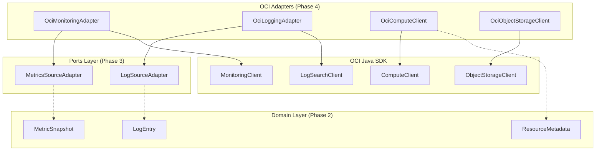

# OCI SDK Integrations Design

## Overview

This document details the architectural approach for implementing OCI SDK adapter classes that bridge the application's domain layer to Oracle Cloud Infrastructure services.

## Architecture



## Component Details

### OciConfig

Configuration record holding OCI connection settings:

| Field | Type | Required | Default | Notes |
|-------|------|----------|---------|-------|
| `compartmentId` | String | Yes | - | OCI compartment for API calls |
| `region` | String | No | SDK default | Override region if needed |
| `configFilePath` | String | No | `~/.oci/config` | Path to OCI config file |
| `profile` | String | No | `DEFAULT` | Config file profile name |

### OciAuthProviderFactory

Factory for creating OCI `AuthenticationDetailsProvider` instances. Follows the chain-of-responsibility pattern:

1. **Instance Principal** - Auto-detected when running on OCI compute
2. **Config File** - Standard `~/.oci/config` authentication
3. **Environment Variables** - Fallback using `OCI_*` env vars

### OciMonitoringAdapter

Implements `MetricsSourceAdapter` for OCI Monitoring API.

**Key Considerations:**
- Uses MQL (Monitoring Query Language) for metric queries
- Default namespace: `oci_computeagent` 
- Supports filtering by resource OCID
- Returns datapoints within the specified lookback window

**Query Construction:**
```
CpuUtilization[1m]{resourceId = "<instanceOcid>"}.mean()
```

### OciLoggingAdapter

Implements `LogSourceAdapter` for OCI Logging Search API.

**Key Considerations:**
- Uses SQL-like query syntax
- Searches across log groups in the compartment
- Supports combining resource filters with custom queries
- Handles pagination for large result sets

**Query Pattern:**
```sql
search "<compartmentOcid>/_Audit" | source = '<resourceId>' | <userQuery>
```

### OciComputeClient

Wrapper for OCI Compute API to fetch instance metadata.

**Field Mapping:**

| OCI Instance Field | ResourceMetadata Field | Notes |
|--------------------|------------------------|-------|
| `id` | `ocid` | Primary identifier |
| `displayName` | `displayName` | Human-readable name |
| `compartmentId` | `compartmentId` | Container reference |
| `shape` | `shape` | e.g., `VM.Standard2.1` |
| `availabilityDomain` | `availabilityDomain` | e.g., `AD-1` |
| `freeformTags` | `freeformTags` | Direct copy |
| `definedTags` | `definedTags` | Flattened from nested map |

### OciObjectStorageClient

Wrapper for OCI Object Storage to manage runbook files.

**Operations:**
- `listRunbooks(namespace, bucket)` - List `.md` files in bucket
- `getRunbookContent(namespace, bucket, objectName)` - Read file content

## Error Handling Strategy

| Error Type | Handling | User Impact |
|------------|----------|-------------|
| `BmcException` (404) | Return `Optional.empty()` | Resource not found, graceful degradation |
| `BmcException` (401/403) | Throw `OciAuthenticationException` | Configuration error, fail fast |
| `BmcException` (429) | Retry with exponential backoff | Transient, automatic recovery |
| `BmcException` (500+) | Retry up to 3 times, then fail | Service issue, log and alert |
| Timeout | Use configurable timeout, fail after | Network issue |

## Testing Strategy

### Unit Tests
- Mock OCI SDK clients using Mockito
- Verify correct request construction
- Test response mapping to domain models
- Cover error scenarios

### Mock Data
JSON fixtures in `src/test/resources/oci/`:
- `mock-monitoring-response.json`
- `mock-logging-response.json`
- `mock-compute-response.json`

### Integration Tests (Future)
- Require live OCI credentials
- Use dedicated test compartment
- Run in CI/CD with secrets
- Skip if credentials unavailable

## Async Pattern

All adapters follow Helidon SE's non-blocking philosophy:

```java
public CompletableFuture<List<MetricSnapshot>> fetchMetrics(
    String resourceId, 
    Duration lookback
) {
    return CompletableFuture.supplyAsync(() -> {
        // OCI SDK call (blocking)
        var response = monitoringClient.summarizeMetricsData(...);
        // Transform to domain model
        return response.getItems().stream()
            .flatMap(this::toMetricSnapshots)
            .toList();
    }, executor);
}
```

## Security Considerations

1. **No credential hardcoding** - All secrets via OCI config or env vars
2. **Least privilege IAM** - Adapters only need read permissions
3. **Audit logging** - OCI Audit tracks all API calls automatically
4. **Network isolation** - Private subnets with service gateways preferred
