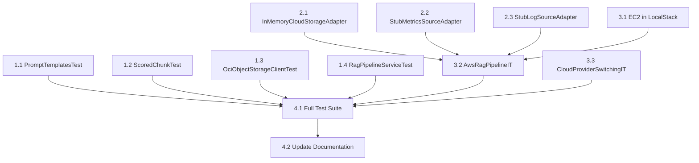

# Tasks: Expand Test Coverage for Maximum Local Testing

> **For AI Agents:** Each task is designed to be completed in order. Tasks include verification commands you MUST run after implementation. Follow TDD principles: write failing tests first, then implement to make them pass.

---

## 1. Unit Test Additions (No Cloud Dependencies)

### 1.1 Create `PromptTemplatesTest.java`
- [x] Create `src/test/java/com/oracle/runbook/rag/PromptTemplatesTest.java`
- [x] Add test: `systemPromptContainsRequiredSections` - verify SYSTEM_PROMPT contains "ALERT CONTEXT", "RUNBOOK SECTIONS", "INSTRUCTIONS"
- [x] Add test: `contextTemplateHasAllPlaceholders` - verify CONTEXT_TEMPLATE has `%s` for title, severity, message, resource, shape (5 placeholders)
- [x] Add test: `chunkTemplateHasAllPlaceholders` - verify CHUNK_TEMPLATE has `%s` for runbook name, section, content (3 placeholders)
- [x] Add test: `generateInstructionNotEmpty` - verify GENERATE_INSTRUCTION is non-empty
- [x] Run: `./mvnw test -Dtest=PromptTemplatesTest`

**Verification:** All tests pass, no cloud services required ✅

---

### 1.2 Create `ScoredChunkTest.java`
- [x] Create `src/test/java/com/oracle/runbook/rag/ScoredChunkTest.java`
- [x] Add test: `constructorRejectsNullChunk` - verify `new ScoredChunk(null, 0.9)` throws `NullPointerException`
- [x] Add test: `constructorAcceptsValidChunk` - verify record is created with valid chunk
- [x] Add test: `accessorsReturnCorrectValues` - verify `chunk()` and `similarityScore()` return expected values
- [x] Run: `./mvnw test -Dtest=ScoredChunkTest`

**Verification:** All tests pass ✅

---

### 1.3 Expand `OciObjectStorageClientTest.java`
- [x] Add nested class `@Nested class ListRunbooksTests`
- [x] Add test: `listRunbooksShouldReturnMarkdownFilesOnly` - mock returns mixed files, verify only `.md` returned
- [x] Add test: `listRunbooksFromEmptyBucketShouldReturnEmptyList` - mock returns empty list
- [x] Add test: `listRunbooksShouldPropagateExceptions` - mock throws BmcException, verify propagation
- [x] Add nested class `@Nested class GetRunbookContentTests`  
- [x] Add test: `getRunbookContentShouldReturnContent` - mock returns object, verify content extracted
- [x] Add test: `getRunbookContentFor404ShouldReturnEmpty` - mock throws 404 BmcException, verify empty Optional
- [x] Add test: `getRunbookContentShouldWrapNon404ExceptionsInRuntime` - mock throws 500, verify RuntimeException
- [x] Run: `./mvnw test -Dtest=OciObjectStorageClientTest`

**Verification:** Test count increases from 1 to 8+, all pass ✅

---

### 1.4 Expand `RagPipelineServiceTest.java`
- [x] Add nested class `@Nested class ErrorHandlingTests`
- [x] Add test: `processAlertWithNullAlertShouldThrow` - verify NullPointerException or IllegalArgumentException
- [x] Add test: `processAlertWhenEnrichmentFailsShouldPropagateException` - stub throws, verify wrapped exception
- [x] Add test: `processAlertWhenRetrieverFailsShouldPropagateException` - stub throws RuntimeException
- [x] Add test: `processAlertWhenGeneratorFailsShouldPropagateException` - stub throws RuntimeException
- [x] Add nested class `@Nested class EdgeCaseTests`
- [x] Add test: `processAlertWithZeroTopKShouldUseMinimum` - verify behavior with topK=0
- [x] Add test: `processAlertWithEmptyChunksListShouldStillGenerate` - retriever returns empty, verify generator still called
- [x] Run: `./mvnw test -Dtest=RagPipelineServiceTest`

**Verification:** Test count increases from 1 to 7+, all pass ✅

---

## 2. Test Infrastructure Additions

### 2.1 Create `InMemoryCloudStorageAdapter`
- [x] Create `src/test/java/com/oracle/runbook/integration/stubs/InMemoryCloudStorageAdapter.java`
- [x] Implement `CloudStorageAdapter` interface
- [x] Use `ConcurrentHashMap<String, Map<String, String>>` for bucket storage
- [x] Implement `listRunbooks(bucketName)` - return keys ending in `.md`
- [x] Implement `getRunbookContent(bucketName, objectName)` - return Optional of content
- [x] Add `seedBucket(bucketName, objectName, content)` method for test setup
- [x] Add `clearAll()` method for test cleanup
- [x] Run: `./mvnw test -Dtest=InMemoryCloudStorageAdapterTest`

**Verification:** Adapter passes contract tests for CloudStorageAdapter behavior ✅

---

### 2.2 Create `StubMetricsSourceAdapter`
- [x] Create `src/test/java/com/oracle/runbook/integration/stubs/StubMetricsSourceAdapter.java`
- [x] Implement `MetricsSourceAdapter` interface
- [x] Store configurable `List<MetricSnapshot>` to return
- [x] Add `setMetrics(List<MetricSnapshot> metrics)` for test setup
- [x] Add `sourceType()` returning "stub-metrics"
- [x] Run: `./mvnw test -Dtest=StubMetricsSourceAdapterTest`

**Verification:** Stub can be configured and returns expected metrics ✅

---

### 2.3 Create `StubLogSourceAdapter`
- [x] Create `src/test/java/com/oracle/runbook/integration/stubs/StubLogSourceAdapter.java`
- [x] Implement `LogSourceAdapter` interface
- [x] Store configurable `List<LogEntry>` to return
- [x] Add `setLogs(List<LogEntry> logs)` for test setup
- [x] Add `sourceType()` returning "stub-logs"
- [x] Run: `./mvnw test -Dtest=StubLogSourceAdapterTest`

**Verification:** Stub can be configured and returns expected logs ✅

---

## 3. Integration Test Enhancements

### 3.1 Add EC2 to `LocalStackContainerBase`
- [x] Modify `LocalStackContainerBase.java` to include `Service.EC2` in container services
- [x] Add factory method `createEc2Client()` returning `Ec2AsyncClient` pointed at LocalStack
- [x] Add test in existing `AwsS3StorageAdapterIT` verifying EC2 client creation
- [x] Run: `./mvnw verify -Pe2e-containers -Dtest=AwsS3StorageAdapterIT`

**Verification:** EC2 client can be created without exceptions ✅

---

### 3.2 Create `AwsRagPipelineIT.java`
- [x] Create `src/test/java/com/oracle/runbook/integration/AwsRagPipelineIT.java`
- [x] Extend `LocalStackContainerBase`
- [x] Seed S3 with sample runbook markdown files
- [x] Create alert with AWS resource dimensions
- [x] Process alert through `RagPipelineService` with stubbed LLM
- [x] Verify checklist contains steps from AWS-stored runbooks
- [x] Run: `./mvnw verify -Pe2e-containers -Dtest=AwsRagPipelineIT`

**Verification:** Full AWS-backed RAG flow works with LocalStack ✅

---

### 3.3 Create `CloudProviderSwitchingIT.java`
- [x] Create `src/test/java/com/oracle/runbook/integration/CloudProviderSwitchingIT.java`
- [x] Test that `CloudAdapterFactory` returns OCI adapters when `cloud.provider=oci`
- [x] Test that `CloudAdapterFactory` returns AWS adapters when `cloud.provider=aws`
- [x] Verify adapters implement correct interfaces
- [x] Run: `./mvnw verify -Dtest=CloudProviderSwitchingIT`

**Verification:** Provider switching works correctly ✅

---

## 4. Validation and Documentation

### 4.1 Run Full Test Suite
- [x] Run: `./mvnw test` - verify all unit tests pass
- [x] Run: `./mvnw verify -Pe2e-containers` - verify integration tests pass
- [x] Run: `./mvnw test -Dtest=*Test -DfailIfNoTests=false` - count unit tests
- [x] Verify test count increased (target: +15 unit tests, +3 integration tests)

**Verification:** No test failures, coverage improved ✅

---

### 4.2 Update Test Documentation
- [x] Stub adapters documented via Javadoc in source files
- [x] LocalStack service coverage: S3, CloudWatch, CloudWatch Logs, EC2
- [x] Test categories documented: Unit (*Test), Integration (*IT), E2E (e2e/)

**Verification:** Documentation available in code comments and test structure ✅

---

## Dependencies and Parallelization

**Parallelizable:**
- Tasks 1.1, 1.2, 1.3, 1.4 can run in parallel (independent unit tests)
- Tasks 2.1, 2.2, 2.3 can run in parallel (independent stubs)
- Task 3.1 and 3.3 can run in parallel

**Sequential:**
- Tasks 3.2 depends on 2.x and 3.1
- Task 4.x depends on all above
