# Design: Enable AWS Full-Stack Functionality

## Overview

This design documents the architectural decisions for enabling complete AWS functionality as the default cloud provider.

## Component Architecture

```mermaid
flowchart TB
    subgraph Ingestion["📥 Alert Ingestion"]
        SNS[CloudWatch → SNS] --> ADAPTER[AwsSnsAlertSourceAdapter]
        ADAPTER --> ALERT[Alert Domain Model]
    end

    subgraph LLM["🧠 LLM Provider"]
        BEDROCK[AWS Bedrock]
        EMBED[Cohere Embed v3]
        GEN[Claude 3 Haiku]
        BEDROCK --> EMBED
        BEDROCK --> GEN
    end

    subgraph Factory["🏭 CloudAdapterFactory"]
        STORAGE[getStorageAdapterClass]
        COMPUTE[getComputeMetadataAdapterClass]
        METRICS[getMetricsAdapterClass]
        LOGS[getLogsAdapterClass]
        ALERTS[getAlertSourceAdapterClass]
        LLMPROV[getLlmProviderClass]
    end
```



## Design Decisions

### Decision 1: SNS Message Parsing

**Choice:** Parse raw SNS-wrapped CloudWatch Alarm JSON

**Rationale:**
- SNS wraps CloudWatch Alarm messages in an envelope
- Need to handle both SNS notification format and subscription confirmation
- Extract `Message` field which contains the actual CloudWatch Alarm JSON

**Message Structure:**
```json
{
  "Type": "Notification",
  "MessageId": "...",
  "TopicArn": "arn:aws:sns:...",
  "Message": "{\"AlarmName\":\"...\",\"NewStateValue\":\"ALARM\",...}",
  "Timestamp": "..."
}
```

### Decision 2: Severity Mapping

**Approved mapping:**
| CloudWatch State | Alert Severity |
|------------------|----------------|
| `ALARM` | `CRITICAL` |
| `INSUFFICIENT_DATA` | `WARNING` |
| `OK` | Skip (don't generate) |

### Decision 3: LLM Provider Abstraction

**Approach:** Support multiple LLM providers with a local-first MVP strategy.

| Provider | Use Case | Text Model | Embedding Model |
|----------|----------|------------|------------------|
| **Ollama (default)** | MVP / Local dev | `llama3.2:3b` | `nomic-embed-text` |
| **AWS Bedrock** | Production | Claude 3 Haiku | Cohere Embed v3 |

**MVP Default: Ollama**
- Zero cloud costs during development
- Fast iteration without API latency
- Works offline / air-gapped
- Model: `llama3.2:3b` (small, fast, sufficient for checklist generation)
- Embeddings: `nomic-embed-text` (768 dimensions)

**Production: AWS Bedrock**
- Claude 3 Haiku: `anthropic.claude-3-haiku-20240307-v1:0`
- Cohere Embed v3: `cohere.embed-english-v3` (1024 dimensions, MTEB 64.5%)

### Decision 4: Factory Enhancement Pattern

**Approach:** Add new factory methods following existing pattern

```java
public Class<? extends MetricsSourceAdapter> getMetricsAdapterClass() {
    return switch (providerType) {
        case "aws" -> AwsCloudWatchMetricsAdapter.class;
        case "oci" -> OciMonitoringAdapter.class;
        default -> throw new IllegalStateException(...);
    };
}
```

### Decision 5: CDK Integration

**Approach:** Extend existing CDK stack (not separate test stack)

Required additions:
- SNS topic for CloudWatch Alarm testing
- IAM permissions for Bedrock model invocation

## Configuration Schema

### application.yaml

```yaml
cloud:
  provider: aws  # Default changed from oci

  aws:
    region: ${AWS_REGION:us-west-2}
    storage:
      bucket: ${AWS_S3_BUCKET:runbook-synthesizer-runbooks}

llm:
  provider: ollama  # MVP default: ollama, Production: aws-bedrock

  ollama:
    baseUrl: ${OLLAMA_BASE_URL:http://localhost:11434}
    textModel: llama3.2:3b
    embeddingModel: nomic-embed-text

  aws-bedrock:
  aws-bedrock:
    region: ${AWS_REGION:us-west-2}
    embeddingModelId: cohere.embed-english-v3
    textModelId: anthropic.claude-3-haiku-20240307-v1:0
```

## Dependencies

### AWS SDK Additions

```xml
<dependency>
    <groupId>software.amazon.awssdk</groupId>
    <artifactId>bedrockruntime</artifactId>
</dependency>
```

Note: SNS SDK not required for parsing—only need JSON parsing of SNS message format.

### Ollama (Local LLM)

No Java dependency required—uses HTTP REST API:
- Text generation: `POST /api/generate`
- Embeddings: `POST /api/embeddings`

**Installation:** `ollama pull llama3.2:3b && ollama pull nomic-embed-text`

## Test Strategy

| Component | Unit Test | LocalStack | Cloud E2E |
|-----------|-----------|------------|-----------|
| AwsSnsAlertSourceAdapter | ✅ | ❌ N/A | ✅ |
| AwsBedrockLlmProvider | ✅ (mock) | ❌ N/A | ✅ |
| CloudAdapterFactory | ✅ | ❌ N/A | ❌ |
| Configuration | ✅ | ❌ | ✅ |

LocalStack doesn't support Bedrock, so LLM tests require real AWS.
