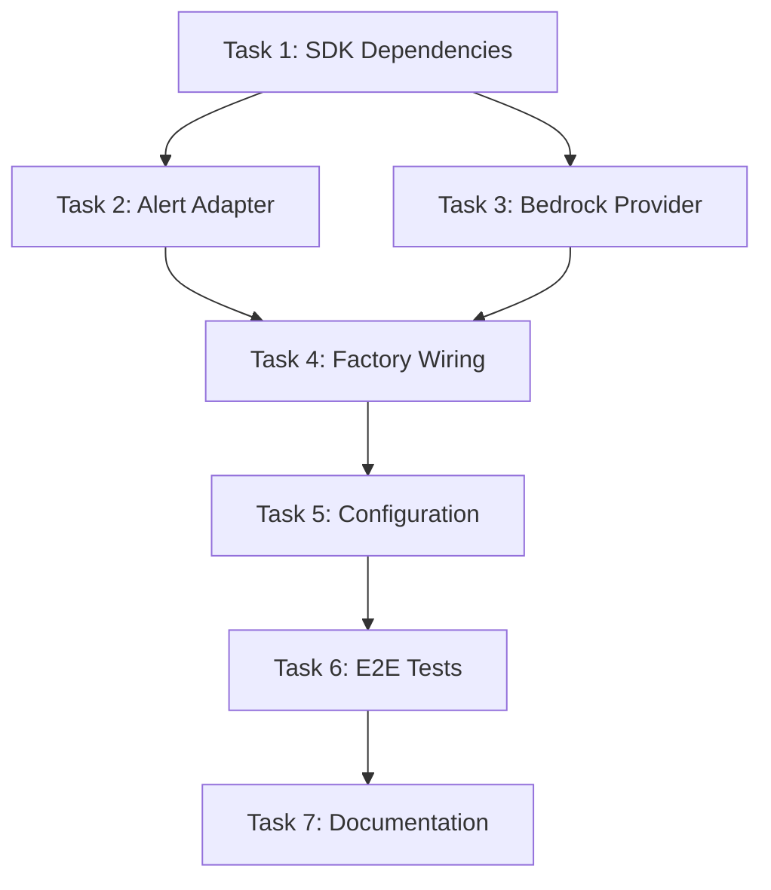

# Tasks: Enable AWS Full-Stack Functionality

## Task 1: Add AWS SDK Dependencies

**Description:** Add required AWS SDK artifacts to pom.xml for Bedrock runtime.

### Subtasks
- [ ] 1.1 Add `software.amazon.awssdk:bedrockruntime` dependency
- [ ] 1.2 Verify Maven compiles successfully

### Verification Steps
```bash
cd c:\Users\bwend\repos\ops-scribe
mvn compile -q
```
**Expected:** Build succeeds with no errors.

### Acceptance Criteria
- [ ] `pom.xml` contains `bedrockruntime` dependency
- [ ] `mvn compile` passes

---

## Task 2: Implement AwsSnsAlertSourceAdapter

**Description:** Create adapter to parse CloudWatch Alarm JSON delivered via SNS webhook.

### Subtasks
- [ ] 2.1 Create `AwsSnsAlertSourceAdapter.java` in `infrastructure/cloud/aws/`
- [ ] 2.2 Implement `sourceType()` returning `"aws-cloudwatch-sns"`
- [ ] 2.3 Implement `canHandle()` to detect SNS/CloudWatch signature
- [ ] 2.4 Implement `parseAlert()` with severity mapping:
  - `ALARM` → `CRITICAL`
  - `INSUFFICIENT_DATA` → `WARNING`
  - `OK` → Return null (skip)
- [ ] 2.5 Create unit tests `AwsSnsAlertSourceAdapterTest.java`

### Verification Steps
```bash
cd c:\Users\bwend\repos\ops-scribe
mvn test -Dtest=AwsSnsAlertSourceAdapterTest -q
```
**Expected:** All unit tests pass.

### Acceptance Criteria
- [ ] `AwsSnsAlertSourceAdapter` implements `AlertSourceAdapter` interface
- [ ] Parses SNS message envelope correctly (extracts `Message` field)
- [ ] Parses CloudWatch Alarm JSON within Message
- [ ] Maps `AlarmName` → `Alert.title`
- [ ] Maps `NewStateReason` → `Alert.message`
- [ ] Maps `NewStateValue` → `Alert.severity` (using approved mapping)
- [ ] Returns null for `OK` state
- [ ] Unit tests cover: valid ALARM, valid INSUFFICIENT_DATA, OK state skip, invalid JSON handling

### Sample Test Payloads
See `src/test/resources/samples/cloudwatch-alarm-sns.json` (to be created)

---

## Task 3: Implement LLM Providers (Ollama + Bedrock)

**Description:** Create pluggable LLM providers with Ollama as MVP default and AWS Bedrock for production.

### Subtask 3A: OllamaLlmProvider (MVP Default)

- [ ] 3A.1 Create `OllamaLlmProvider.java` in `infrastructure/llm/`
- [ ] 3A.2 Implement `providerId()` returning `"ollama"`
- [ ] 3A.3 Implement `generateText()` using Ollama REST API:
  - Endpoint: `POST /api/generate`
  - Model: `llama3.2:3b` (configurable)
- [ ] 3A.4 Implement `generateEmbedding()` using Ollama REST API:
  - Endpoint: `POST /api/embeddings`
  - Model: `nomic-embed-text`
- [ ] 3A.5 Implement `generateEmbeddings()` for batch embeddings
- [ ] 3A.6 Create `OllamaConfig.java` record for configuration
- [ ] 3A.7 Create unit tests `OllamaLlmProviderTest.java`

**Verification (Ollama):**
```bash
# Ensure Ollama is running locally
ollama serve &
ollama pull llama3.2:3b
ollama pull nomic-embed-text

cd c:\Users\bwend\repos\ops-scribe
mvn test -Dtest=OllamaLlmProviderTest -q
```

**Acceptance Criteria (Ollama):**
- [ ] `OllamaLlmProvider` implements `LlmProvider` interface
- [ ] Uses async HTTP client for non-blocking calls
- [ ] Connects to configurable Ollama base URL
- [ ] Unit tests pass with WireMock or similar

---

### Subtask 3B: AwsBedrockLlmProvider (Production)

- [ ] 3B.1 Create `AwsBedrockLlmProvider.java` in `infrastructure/cloud/aws/`
- [ ] 3B.2 Implement `providerId()` returning `"aws-bedrock"`
- [ ] 3B.3 Implement `generateText()` using Claude 3 Haiku:
  - Model ID: `anthropic.claude-3-haiku-20240307-v1:0`
  - Use `BedrockRuntimeAsyncClient.invokeModel()`
- [ ] 3B.4 Implement `generateEmbedding()` using Cohere Embed v3:
  - Model ID: `cohere.embed-english-v3`
  - Use `BedrockRuntimeAsyncClient.invokeModel()`
- [ ] 3B.5 Implement `generateEmbeddings()` for batch embeddings
- [ ] 3B.6 Create `AwsBedrockConfig.java` record for configuration
- [ ] 3B.7 Create unit tests `AwsBedrockLlmProviderTest.java` (mocked SDK)

**Verification (Bedrock):**
```bash
cd c:\Users\bwend\repos\ops-scribe
mvn test -Dtest=AwsBedrockLlmProviderTest -q
```

**Acceptance Criteria (Bedrock):**
- [ ] `AwsBedrockLlmProvider` implements `LlmProvider` interface
- [ ] Uses `BedrockRuntimeAsyncClient` for async operations
- [ ] Correctly formats Claude 3 request body (Messages API format)
- [ ] Correctly formats Cohere Embed request body
- [ ] Parses response JSON and extracts embeddings/text
- [ ] Unit tests cover: text generation, single embedding, batch embeddings, error handling

---

## Task 4: Enhance CloudAdapterFactory

**Description:** Add factory methods for metrics, logs, alerts, and LLM adapters.

### Subtasks
- [ ] 4.1 Add `getMetricsAdapterClass()` method
- [ ] 4.2 Add `getLogsAdapterClass()` method
- [ ] 4.3 Add `getAlertSourceAdapterClass()` method
- [ ] 4.4 Add `getLlmProviderClass()` method
- [ ] 4.5 Update `CloudAdapterFactoryTest.java` with new test cases

### Verification Steps
```bash
cd c:\Users\bwend\repos\ops-scribe
mvn test -Dtest=CloudAdapterFactoryTest -q
```
**Expected:** All unit tests pass including new factory methods.

### Acceptance Criteria
- [ ] `getMetricsAdapterClass()` returns `AwsCloudWatchMetricsAdapter.class` for AWS
- [ ] `getLogsAdapterClass()` returns `AwsCloudWatchLogsAdapter.class` for AWS
- [ ] `getAlertSourceAdapterClass()` returns `AwsSnsAlertSourceAdapter.class` for AWS
- [ ] `getLlmProviderClass()` returns `AwsBedrockLlmProvider.class` for AWS
- [ ] All methods throw `IllegalStateException` for unsupported providers
- [ ] Unit tests verify both AWS and OCI provider selection

---

## Task 5: Update Configuration

**Description:** Set AWS as default cloud provider and add complete AWS configuration.

### Subtasks
- [ ] 5.1 Update `application.yaml`:
  - Change `cloud.provider` default to `aws`
  - Uncomment and complete AWS section
  - Add `llm.aws-bedrock` configuration
- [ ] 5.2 Create `AwsBedrockConfig.java` if not created in Task 3
- [ ] 5.3 Update `AwsConfig.java` if additional fields needed
- [ ] 5.4 Add configuration tests

### Verification Steps
```bash
cd c:\Users\bwend\repos\ops-scribe
mvn test -Dtest=*ConfigTest -q
```
**Expected:** All config tests pass.

### Acceptance Criteria
- [ ] `cloud.provider` defaults to `aws`
- [ ] AWS configuration section is complete and uncommented
- [ ] Environment variable placeholders use sensible defaults
- [ ] LLM configuration specifies Bedrock model IDs
- [ ] Application starts successfully with AWS configuration

---

## Task 6: E2E Test Integration

**Description:** Add E2E tests for new components using existing CDK infrastructure.

### Subtasks
- [ ] 6.1 Extend CDK stack with:
  - SNS topic for alarm testing
  - IAM permissions for Bedrock model invocation
- [ ] 6.2 Create `AwsSnsAlertCloudIT.java` for alert parsing E2E
- [ ] 6.3 Create `AwsBedrockLlmCloudIT.java` for LLM E2E
- [ ] 6.4 Update CDK deployment documentation

### Verification Steps
```bash
# Deploy CDK infrastructure
cd c:\Users\bwend\repos\ops-scribe\infra
npm run cdk:deploy

# Run E2E tests
cd c:\Users\bwend\repos\ops-scribe
mvn verify -Pe2e-aws-cloud -Daws.cloud.enabled=true
```
**Expected:** All E2E tests pass against real AWS.

### Acceptance Criteria
- [ ] CDK stack deploys successfully with new resources
- [ ] SNS topic created and accessible
- [ ] Bedrock IAM permissions grant model access
- [ ] `AwsBedrockLlmCloudIT` generates real embeddings
- [ ] `AwsBedrockLlmCloudIT` generates real text
- [ ] E2E tests clean up after themselves

---

## Task 7: Documentation

**Description:** Update documentation to reflect AWS-first approach.

### Subtasks
- [ ] 7.1 Update `docs/ARCHITECTURE.md` with AWS default note
- [ ] 7.2 Update `docs/DESIGN.md` with AWS-first approach and LLM abstraction
- [ ] 7.3 Update `README.md` with AWS quickstart
- [ ] 7.4 Update `openspec/project.md` to reflect AWS as primary

### Verification Steps
Manual review of documentation accuracy.

### Acceptance Criteria
- [ ] Documentation reflects AWS as default provider
- [ ] `docs/DESIGN.md` documents LLM provider abstraction (Ollama vs Bedrock)
- [ ] Setup instructions work for AWS
- [ ] OCI is documented as alternative

---

## Dependency Graph



## Parallelization

- **Parallel:** Tasks 2 and 3 can be implemented in parallel after Task 1
- **Sequential:** Task 4 depends on Tasks 2 and 3 completion
- **Sequential:** Tasks 5, 6, 7 are sequential
