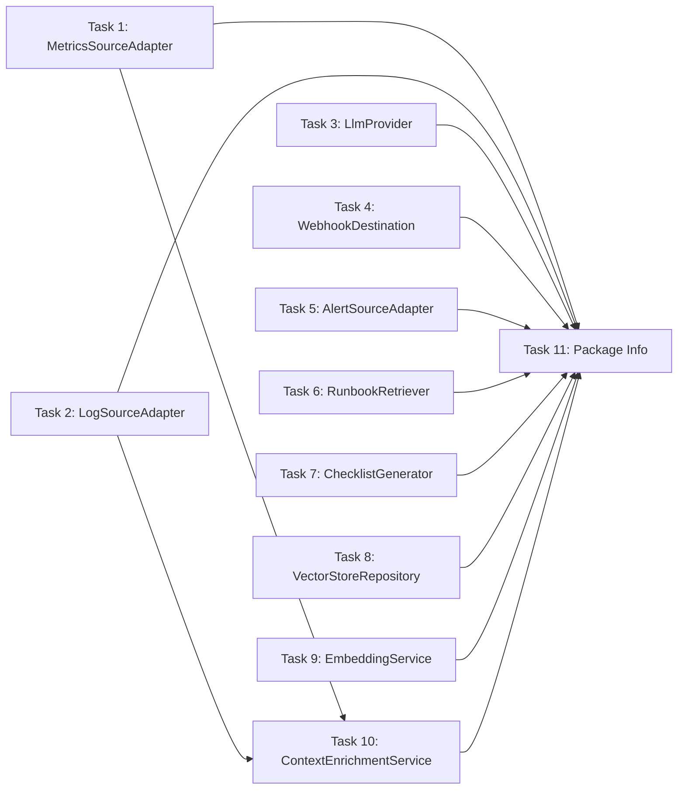

# Implementation Tasks: Ports/Interfaces

> **For Claude:** REQUIRED SUB-SKILL: Use superpowers:executing-plans to implement this plan task-by-task.

**Goal:** Define all port interfaces that establish contracts between the domain layer and external systems (observability sources, LLM providers, output channels, storage).

**Architecture:** Hexagonal Architecture ports layer. Interfaces define contracts; adapters (Phase 4+) provide implementations. All async operations use `CompletableFuture<T>`.

**Tech Stack:** Java 25 records/interfaces, Helidon SE async patterns

---

## Task 1: MetricsSourceAdapter Interface [S]

**Files:**
- Create: `src/main/java/com/oracle/runbook/enrichment/MetricsSourceAdapter.java`
- Test: `src/test/java/com/oracle/runbook/enrichment/MetricsSourceAdapterTest.java`

**Step 1: Write the failing test**

Create a test that verifies the interface contract:
- Test that a mock implementation can be created
- Verify `sourceType()` returns expected identifier
- Verify `fetchMetrics()` signature accepts `String resourceId` and `Duration lookback`
- Verify return type is `CompletableFuture<List<MetricSnapshot>>`

**Step 2: Run test to verify it fails**

```bash
wsl bash -c "cd /mnt/c/Users/bwend/repos/ops-scribe && mvn test -Dtest=MetricsSourceAdapterTest -q"
```
Expected: FAIL - class/interface not found

**Step 3: Write minimal implementation**

Create interface with:
- `String sourceType()` - returns identifier like "oci-monitoring", "prometheus"
- `CompletableFuture<List<MetricSnapshot>> fetchMetrics(String resourceId, Duration lookback)`

**Hints:**
- Import `java.time.Duration` and `java.util.concurrent.CompletableFuture`
- Reference `MetricSnapshot` from domain package
- Add Javadoc explaining the contract

**Step 4: Run test to verify it passes**

```bash
wsl bash -c "cd /mnt/c/Users/bwend/repos/ops-scribe && mvn test -Dtest=MetricsSourceAdapterTest -q"
```
Expected: PASS

**Step 5: Commit**

```bash
git add src/main/java/com/oracle/runbook/enrichment/MetricsSourceAdapter.java src/test/java/com/oracle/runbook/enrichment/MetricsSourceAdapterTest.java
git commit -m "feat(enrichment): add MetricsSourceAdapter interface"
```

---

## Task 2: LogSourceAdapter Interface [S]

**Files:**
- Create: `src/main/java/com/oracle/runbook/enrichment/LogSourceAdapter.java`
- Test: `src/test/java/com/oracle/runbook/enrichment/LogSourceAdapterTest.java`

**Step 1: Write the failing test**

Create test verifying:
- `sourceType()` returns expected identifier ("oci-logging", "loki")
- `fetchLogs()` accepts `String resourceId`, `Duration lookback`, `String query`
- Returns `CompletableFuture<List<LogEntry>>`

**Step 2: Run test to verify it fails**

```bash
wsl bash -c "cd /mnt/c/Users/bwend/repos/ops-scribe && mvn test -Dtest=LogSourceAdapterTest -q"
```
Expected: FAIL

**Step 3: Write minimal implementation**

Create interface following DESIGN.md pattern:
```java
String sourceType();  // "oci-logging", "loki"
CompletableFuture<List<LogEntry>> fetchLogs(String resourceId, Duration lookback, String query);
```

**Hints:**
- The `query` parameter allows source-specific query syntax (LogQL for Loki, filter expressions for OCI)
- Reference `LogEntry` from domain package

**Step 4: Run test to verify it passes**

```bash
wsl bash -c "cd /mnt/c/Users/bwend/repos/ops-scribe && mvn test -Dtest=LogSourceAdapterTest -q"
```
Expected: PASS

**Step 5: Commit**

```bash
git add src/main/java/com/oracle/runbook/enrichment/LogSourceAdapter.java src/test/java/com/oracle/runbook/enrichment/LogSourceAdapterTest.java
git commit -m "feat(enrichment): add LogSourceAdapter interface"
```

---

## Task 3: LlmProvider Interface [M]

**Files:**
- Create: `src/main/java/com/oracle/runbook/rag/LlmProvider.java`
- Test: `src/test/java/com/oracle/runbook/rag/LlmProviderTest.java`

**Step 1: Write the failing test**

Create comprehensive test for:
- `providerId()` returns identifier ("oci-genai", "openai", "ollama")
- `generateText(String prompt, GenerationConfig config)` returns `CompletableFuture<String>`
- `generateEmbedding(String text)` returns `CompletableFuture<float[]>`
- `generateEmbeddings(List<String> texts)` returns `CompletableFuture<List<float[]>>`

**Step 2: Run test to verify it fails**

```bash
wsl bash -c "cd /mnt/c/Users/bwend/repos/ops-scribe && mvn test -Dtest=LlmProviderTest -q"
```
Expected: FAIL

**Step 3: Write minimal implementation**

Create interface matching DESIGN.md:
```java
String providerId();
CompletableFuture<String> generateText(String prompt, GenerationConfig config);
CompletableFuture<float[]> generateEmbedding(String text);
CompletableFuture<List<float[]>> generateEmbeddings(List<String> texts);
```

**Hints:**
- `GenerationConfig` already exists from Phase 2
- Batch embeddings method is for document ingestion efficiency
- All methods are async for non-blocking pipeline

**Step 4: Run test to verify it passes**

```bash
wsl bash -c "cd /mnt/c/Users/bwend/repos/ops-scribe && mvn test -Dtest=LlmProviderTest -q"
```
Expected: PASS

**Step 5: Commit**

```bash
git add src/main/java/com/oracle/runbook/rag/LlmProvider.java src/test/java/com/oracle/runbook/rag/LlmProviderTest.java
git commit -m "feat(rag): add LlmProvider interface for pluggable LLM backends"
```

---

## Task 4: WebhookDestination Interface [M]

**Files:**
- Create: `src/main/java/com/oracle/runbook/output/WebhookDestination.java`
- Create: `src/main/java/com/oracle/runbook/output/WebhookResult.java`
- Test: `src/test/java/com/oracle/runbook/output/WebhookDestinationTest.java`

**Step 1: Write the failing test**

Test interface contract:
- `name()` returns webhook name (e.g., "slack-oncall")
- `type()` returns webhook type ("slack", "pagerduty", "generic")
- `send(DynamicChecklist checklist)` returns `CompletableFuture<WebhookResult>`
- `shouldSend(DynamicChecklist checklist)` returns `boolean` for filter logic

**Step 2: Run test to verify it fails**

```bash
wsl bash -c "cd /mnt/c/Users/bwend/repos/ops-scribe && mvn test -Dtest=WebhookDestinationTest -q"
```
Expected: FAIL

**Step 3: Write minimal implementation**

Create `WebhookResult` record:
- `boolean success`
- `int statusCode`
- `String responseBody`
- `Optional<String> errorMessage`

Create `WebhookDestination` interface per DESIGN.md:
```java
String name();
String type();
CompletableFuture<WebhookResult> send(DynamicChecklist checklist);
boolean shouldSend(DynamicChecklist checklist);
```

**Hints:**
- `shouldSend()` enables filtering by severity, labels, etc.
- `WebhookResult` captures HTTP response details for logging/retry logic

**Step 4: Run test to verify it passes**

```bash
wsl bash -c "cd /mnt/c/Users/bwend/repos/ops-scribe && mvn test -Dtest=WebhookDestinationTest -q"
```
Expected: PASS

**Step 5: Commit**

```bash
git add src/main/java/com/oracle/runbook/output/ src/test/java/com/oracle/runbook/output/
git commit -m "feat(output): add WebhookDestination interface and WebhookResult record"
```

---

## Task 5: AlertSourceAdapter Interface [S]

**Files:**
- Create: `src/main/java/com/oracle/runbook/ingestion/AlertSourceAdapter.java`
- Test: `src/test/java/com/oracle/runbook/ingestion/AlertSourceAdapterTest.java`

**Step 1: Write the failing test**

Test interface contract:
- `sourceType()` returns identifier ("oci-monitoring", "oci-events")
- `parseAlert(String rawPayload)` returns `Alert` domain object
- `canHandle(String rawPayload)` returns `boolean` to check if adapter handles this payload

**Step 2: Run test to verify it fails**

```bash
wsl bash -c "cd /mnt/c/Users/bwend/repos/ops-scribe && mvn test -Dtest=AlertSourceAdapterTest -q"
```
Expected: FAIL

**Step 3: Write minimal implementation**

Create interface:
```java
String sourceType();
Alert parseAlert(String rawPayload);
boolean canHandle(String rawPayload);
```

**Hints:**
- `canHandle()` allows routing payloads to correct adapter
- `parseAlert()` transforms source-specific JSON to canonical `Alert` model
- This is synchronous since parsing is fast and doesn't need async

**Step 4: Run test to verify it passes**

```bash
wsl bash -c "cd /mnt/c/Users/bwend/repos/ops-scribe && mvn test -Dtest=AlertSourceAdapterTest -q"
```
Expected: PASS

**Step 5: Commit**

```bash
git add src/main/java/com/oracle/runbook/ingestion/AlertSourceAdapter.java src/test/java/com/oracle/runbook/ingestion/AlertSourceAdapterTest.java
git commit -m "feat(ingestion): add AlertSourceAdapter interface"
```

---

## Task 6: RunbookRetriever Interface [S]

**Files:**
- Create: `src/main/java/com/oracle/runbook/rag/RunbookRetriever.java`
- Test: `src/test/java/com/oracle/runbook/rag/RunbookRetrieverTest.java`

**Step 1: Write the failing test**

Test interface contract:
- `retrieve(EnrichedContext context, int topK)` returns `List<RetrievedChunk>`

**Step 2: Run test to verify it fails**

```bash
wsl bash -c "cd /mnt/c/Users/bwend/repos/ops-scribe && mvn test -Dtest=RunbookRetrieverTest -q"
```
Expected: FAIL

**Step 3: Write minimal implementation**

Create interface per DESIGN.md:
```java
List<RetrievedChunk> retrieve(EnrichedContext context, int topK);
```

**Hints:**
- Uses `EnrichedContext` to build query (alert + metrics + logs)
- Returns `RetrievedChunk` which includes similarity scores
- Synchronous for simplicity; implementations may use internal async

**Step 4: Run test to verify it passes**

```bash
wsl bash -c "cd /mnt/c/Users/bwend/repos/ops-scribe && mvn test -Dtest=RunbookRetrieverTest -q"
```
Expected: PASS

**Step 5: Commit**

```bash
git add src/main/java/com/oracle/runbook/rag/RunbookRetriever.java src/test/java/com/oracle/runbook/rag/RunbookRetrieverTest.java
git commit -m "feat(rag): add RunbookRetriever interface"
```

---

## Task 7: ChecklistGenerator Interface [S]

**Files:**
- Create: `src/main/java/com/oracle/runbook/rag/ChecklistGenerator.java`
- Test: `src/test/java/com/oracle/runbook/rag/ChecklistGeneratorTest.java`

**Step 1: Write the failing test**

Test interface contract:
- `generate(EnrichedContext context, List<RetrievedChunk> relevantChunks)` returns `DynamicChecklist`

**Step 2: Run test to verify it fails**

```bash
wsl bash -c "cd /mnt/c/Users/bwend/repos/ops-scribe && mvn test -Dtest=ChecklistGeneratorTest -q"
```
Expected: FAIL

**Step 3: Write minimal implementation**

Create interface per DESIGN.md:
```java
DynamicChecklist generate(EnrichedContext context, List<RetrievedChunk> relevantChunks);
```

**Hints:**
- Combines context and retrieved runbook chunks using LLM
- Returns fully populated `DynamicChecklist`
- Implementation will use `LlmProvider` internally

**Step 4: Run test to verify it passes**

```bash
wsl bash -c "cd /mnt/c/Users/bwend/repos/ops-scribe && mvn test -Dtest=ChecklistGeneratorTest -q"
```
Expected: PASS

**Step 5: Commit**

```bash
git add src/main/java/com/oracle/runbook/rag/ChecklistGenerator.java src/test/java/com/oracle/runbook/rag/ChecklistGeneratorTest.java
git commit -m "feat(rag): add ChecklistGenerator interface"
```

---

## Task 8: VectorStoreRepository Interface [M]

**Files:**
- Create: `src/main/java/com/oracle/runbook/rag/VectorStoreRepository.java`
- Test: `src/test/java/com/oracle/runbook/rag/VectorStoreRepositoryTest.java`

**Step 1: Write the failing test**

Test interface contract:
- `store(RunbookChunk chunk)` - stores a single chunk
- `storeBatch(List<RunbookChunk> chunks)` - batch store for efficiency
- `search(float[] queryEmbedding, int topK)` returns `List<RunbookChunk>`
- `delete(String runbookPath)` - removes all chunks for a runbook path

**Step 2: Run test to verify it fails**

```bash
wsl bash -c "cd /mnt/c/Users/bwend/repos/ops-scribe && mvn test -Dtest=VectorStoreRepositoryTest -q"
```
Expected: FAIL

**Step 3: Write minimal implementation**

Create interface:
```java
void store(RunbookChunk chunk);
void storeBatch(List<RunbookChunk> chunks);
List<RunbookChunk> search(float[] queryEmbedding, int topK);
void delete(String runbookPath);
```

**Hints:**
- Oracle 23ai implementation will use `AI_VECTOR_SEARCH` functions
- `delete()` enables re-indexing when runbooks are updated
- Consider async variants for production (can add later)

**Step 4: Run test to verify it passes**

```bash
wsl bash -c "cd /mnt/c/Users/bwend/repos/ops-scribe && mvn test -Dtest=VectorStoreRepositoryTest -q"
```
Expected: PASS

**Step 5: Commit**

```bash
git add src/main/java/com/oracle/runbook/rag/VectorStoreRepository.java src/test/java/com/oracle/runbook/rag/VectorStoreRepositoryTest.java
git commit -m "feat(rag): add VectorStoreRepository interface"
```

---

## Task 9: EmbeddingService Interface [S]

**Files:**
- Create: `src/main/java/com/oracle/runbook/rag/EmbeddingService.java`
- Test: `src/test/java/com/oracle/runbook/rag/EmbeddingServiceTest.java`

**Step 1: Write the failing test**

Test interface contract:
- `embed(String text)` returns `CompletableFuture<float[]>`
- `embedBatch(List<String> texts)` returns `CompletableFuture<List<float[]>>`

**Step 2: Run test to verify it fails**

```bash
wsl bash -c "cd /mnt/c/Users/bwend/repos/ops-scribe && mvn test -Dtest=EmbeddingServiceTest -q"
```
Expected: FAIL

**Step 3: Write minimal implementation**

Create interface:
```java
CompletableFuture<float[]> embed(String text);
CompletableFuture<List<float[]>> embedBatch(List<String> texts);
```

**Hints:**
- This is a facade over `LlmProvider.generateEmbedding()`
- Separates embedding concern from text generation
- Implementation may add caching or normalization

**Step 4: Run test to verify it passes**

```bash
wsl bash -c "cd /mnt/c/Users/bwend/repos/ops-scribe && mvn test -Dtest=EmbeddingServiceTest -q"
```
Expected: PASS

**Step 5: Commit**

```bash
git add src/main/java/com/oracle/runbook/rag/EmbeddingService.java src/test/java/com/oracle/runbook/rag/EmbeddingServiceTest.java
git commit -m "feat(rag): add EmbeddingService interface"
```

---

## Task 10: ContextEnrichmentService Interface [M]

**Files:**
- Create: `src/main/java/com/oracle/runbook/enrichment/ContextEnrichmentService.java`
- Test: `src/test/java/com/oracle/runbook/enrichment/ContextEnrichmentServiceTest.java`

**Step 1: Write the failing test**

Test interface contract:
- `enrich(Alert alert)` returns `CompletableFuture<EnrichedContext>`

**Step 2: Run test to verify it fails**

```bash
wsl bash -c "cd /mnt/c/Users/bwend/repos/ops-scribe && mvn test -Dtest=ContextEnrichmentServiceTest -q"
```
Expected: FAIL

**Step 3: Write minimal implementation**

Create interface:
```java
CompletableFuture<EnrichedContext> enrich(Alert alert);
```

**Hints:**
- Orchestrates calls to `MetricsSourceAdapter`, `LogSourceAdapter`
- Fetches `ResourceMetadata` from compute API
- Aggregates into `EnrichedContext`
- Async to parallelize external calls

**Step 4: Run test to verify it passes**

```bash
wsl bash -c "cd /mnt/c/Users/bwend/repos/ops-scribe && mvn test -Dtest=ContextEnrichmentServiceTest -q"
```
Expected: PASS

**Step 5: Commit**

```bash
git add src/main/java/com/oracle/runbook/enrichment/ContextEnrichmentService.java src/test/java/com/oracle/runbook/enrichment/ContextEnrichmentServiceTest.java
git commit -m "feat(enrichment): add ContextEnrichmentService interface"
```

---

## Task 11: Update Package Info Files [S]

**Files:**
- Modify: `src/main/java/com/oracle/runbook/enrichment/package-info.java`
- Modify: `src/main/java/com/oracle/runbook/rag/package-info.java`
- Modify: `src/main/java/com/oracle/runbook/output/package-info.java`
- Modify: `src/main/java/com/oracle/runbook/ingestion/package-info.java`

**Step 1: Update package documentation**

Update each package-info.java to document the ports/interfaces defined:
- `enrichment`: MetricsSourceAdapter, LogSourceAdapter, ContextEnrichmentService
- `rag`: LlmProvider, RunbookRetriever, ChecklistGenerator, VectorStoreRepository, EmbeddingService
- `output`: WebhookDestination, WebhookResult
- `ingestion`: AlertSourceAdapter

**Hints:**
- Follow existing package-info.java style from domain package
- Include purpose and key interfaces in Javadoc

**Step 2: Run all tests**

```bash
wsl bash -c "cd /mnt/c/Users/bwend/repos/ops-scribe && mvn test -q"
```
Expected: All tests PASS

**Step 3: Commit**

```bash
git add src/main/java/com/oracle/runbook/*/package-info.java
git commit -m "docs: update package-info files for ports layer"
```

---

## Dependencies



**Parallelizable:** Tasks 1-9 can be done in any order. Task 10 depends on Tasks 1-2. Task 11 depends on all others.

---

## Summary

| Task | Component | Complexity | Estimated Time |
|------|-----------|------------|----------------|
| 1 | MetricsSourceAdapter | [S] | 2-3 min |
| 2 | LogSourceAdapter | [S] | 2-3 min |
| 3 | LlmProvider | [M] | 4-5 min |
| 4 | WebhookDestination + Result | [M] | 4-5 min |
| 5 | AlertSourceAdapter | [S] | 2-3 min |
| 6 | RunbookRetriever | [S] | 2-3 min |
| 7 | ChecklistGenerator | [S] | 2-3 min |
| 8 | VectorStoreRepository | [M] | 4-5 min |
| 9 | EmbeddingService | [S] | 2-3 min |
| 10 | ContextEnrichmentService | [M] | 4-5 min |
| 11 | Package Info Updates | [S] | 2-3 min |

**Total: ~32-42 minutes**
