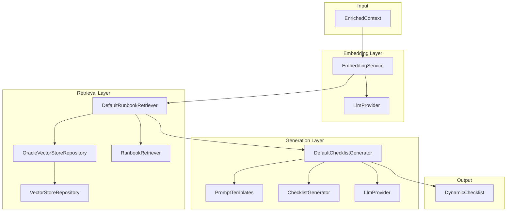

# RAG Pipeline Design

## Overview

The RAG (Retrieval Augmented Generation) pipeline transforms alert context into actionable troubleshooting checklists by:
1. **Embedding** the alert context into vector space
2. **Retrieving** semantically similar runbook chunks from the vector store
3. **Re-ranking** results using metadata (tags, applicable shapes)
4. **Generating** a tailored checklist using the LLM provider

## Architecture



## Component Design

### EmbeddingService

**Purpose:** Wraps `LlmProvider` to provide convenient embedding generation.

```java
public class EmbeddingService {
    private final LlmProvider llmProvider;
    
    public float[] embedText(String text);
    public List<float[]> embedTexts(List<String> texts);
    public float[] embedContext(EnrichedContext context);
}
```

**Key Decisions:**
- Blocks on `CompletableFuture` from `LlmProvider` for simplicity
- `embedContext()` formats alert + resource metadata into a query string
- Does not cache embeddings (caching handled by callers if needed)

### VectorStoreRepository

**Purpose:** Abstract interface for vector storage operations.

```java
public interface VectorStoreRepository {
    void store(RunbookChunk chunk);
    void storeBatch(List<RunbookChunk> chunks);
    List<ScoredChunk> findSimilar(float[] embedding, int topK);
    void deleteByRunbookPath(String path);
}

public record ScoredChunk(RunbookChunk chunk, double similarityScore) {}
```

**Key Decisions:**
- Returns `ScoredChunk` wrapper to include similarity score from vector DB
- `deleteByRunbookPath()` supports runbook updates/removal
- Batch operations for ingestion efficiency

### OracleVectorStoreRepository

**Purpose:** Oracle 23ai implementation using LangChain4j.

**Key Decisions:**
- Uses `OracleEmbeddingStore` from `langchain4j-oracle`
- Maps `RunbookChunk` to LangChain4j `TextSegment` with metadata:
  - `id` → segment ID
  - `tags` → comma-separated string in metadata
  - `applicableShapes` → comma-separated string in metadata
  - `runbookPath`, `sectionTitle` → metadata fields
- Embedding stored as `float[]` → LangChain4j `Embedding`
- Connection pooling via HikariCP for production use

### RunbookRetriever

**Purpose:** Retrieves and ranks relevant runbook chunks.

```java
public interface RunbookRetriever {
    List<RetrievedChunk> retrieve(EnrichedContext context, int topK);
}
```

### DefaultRunbookRetriever

**Purpose:** Default implementation with metadata-based re-ranking.

**Algorithm:**
1. Generate query embedding from `EnrichedContext`
2. Call `VectorStoreRepository.findSimilar()` with `topK * 2` (over-fetch for re-ranking)
3. Calculate metadata boost for each chunk:
   - Tag overlap: +0.1 per matching tag (max +0.3)
   - Shape match: +0.2 if chunk's `applicableShapes` pattern matches resource shape
4. Compute `finalScore = similarityScore + metadataBoost`
5. Sort by `finalScore` descending, return top-K

**Re-ranking Formula:**
```
metadataBoost = min(tagMatchCount * 0.1, 0.3) + (shapeMatches ? 0.2 : 0.0)
finalScore = similarityScore + metadataBoost
```

**Shape Matching:**
- `applicableShapes` uses glob patterns from runbook frontmatter (e.g., `["VM.*", "BM.*"]`)
- Convert to regex: `VM.*` → `^VM\\..*$`
- Match against `ResourceMetadata.shape()`

### PromptTemplates

**Purpose:** Centralized prompt template management.

```java
public final class PromptTemplates {
    public static final String CHECKLIST_GENERATION_PROMPT = """
        You are an SRE assistant generating troubleshooting checklists.
        
        CONTEXT:
        - Alert: {alert.title}
        - Host: {resource.displayName} (Shape: {resource.shape})
        - Current Metrics: {metrics}
        - Recent Logs: {logs}
        
        RELEVANT RUNBOOK SECTIONS:
        {retrieved_chunks}
        
        INSTRUCTIONS:
        1. Generate a numbered checklist specific to THIS host and alert
        2. Include current values where available (e.g., "Memory: 92%")
        3. Prioritize steps based on likelihood given the context
        4. Include exact commands to run
        5. Skip steps that don't apply (e.g., skip nvidia-smi for non-GPU hosts)
        6. Cite which runbook each step comes from
        
        OUTPUT FORMAT:
        Return a JSON object with the following structure:
        {
          "summary": "Brief summary of the issue",
          "steps": [
            {
              "order": 1,
              "instruction": "Check memory usage",
              "rationale": "Memory alert triggered at 92%",
              "currentValue": "92%",
              "expectedValue": "< 80%",
              "priority": "HIGH",
              "commands": ["free -h", "ps aux --sort=-%mem | head -10"],
              "sourceRunbook": "memory/high-memory.md"
            }
          ]
        }
        """;
    
    public static String formatPrompt(EnrichedContext context, List<RetrievedChunk> chunks);
}
```

**Key Decisions:**
- Request JSON output for reliable parsing
- Include source runbook in each step for traceability
- Use placeholder syntax compatible with simple string replacement

### ChecklistGenerator

**Purpose:** Generates structured checklists from context and chunks.

```java
public interface ChecklistGenerator {
    DynamicChecklist generate(EnrichedContext context, List<RetrievedChunk> relevantChunks);
}
```

### DefaultChecklistGenerator

**Purpose:** Default implementation using LLM provider.

**Algorithm:**
1. Format prompt using `PromptTemplates.formatPrompt()`
2. Create `GenerationConfig` with temperature=0.3 (low for deterministic output)
3. Call `LlmProvider.generateText()`
4. Parse JSON response into `DynamicChecklist`
5. Populate `sourceRunbooks` from all unique runbook paths in chunks
6. Set `llmProviderUsed` from `LlmProvider.providerId()`

**Error Handling:**
- If JSON parsing fails, log error and return fallback checklist with single step: "Unable to generate checklist. Please refer to runbook manually."
- Timeout after 30 seconds, configurable via `GenerationConfig`

### RagPipelineService

**Purpose:** Top-level orchestrator for the RAG pipeline.

```java
public class RagPipelineService {
    private final RunbookRetriever retriever;
    private final ChecklistGenerator generator;
    private static final int DEFAULT_TOP_K = 5;
    
    public DynamicChecklist process(EnrichedContext context);
    public DynamicChecklist process(EnrichedContext context, int topK);
}
```

**Key Decisions:**
- Simple facade over retriever + generator
- Default `topK = 5` for balanced precision/recall
- Logs timing at each step for performance monitoring

## Configuration

```yaml
rag:
  retrieval:
    topK: 5
    overFetchMultiplier: 2  # Fetch 2x topK for re-ranking
    tagBoostWeight: 0.1
    tagBoostMax: 0.3
    shapeBoostWeight: 0.2
  generation:
    temperature: 0.3
    maxTokens: 2000
    timeoutSeconds: 30
```

## Testing Strategy

### Unit Tests
- **EmbeddingServiceTest**: Mock `LlmProvider`, verify correct calls
- **OracleVectorStoreRepositoryTest**: Mock `OracleEmbeddingStore`, verify mapping
- **DefaultRunbookRetrieverTest**: Mock dependencies, verify re-ranking logic
- **DefaultChecklistGeneratorTest**: Mock `LlmProvider`, verify parsing
- **PromptTemplatesTest**: Verify template formatting

### Integration Tests
- **RagPipelineIntegrationTest**: End-to-end with in-memory vector store mock
- Use sample runbook embeddings in `src/test/resources/sample-embeddings/`

## Future Enhancements (v1.1+)

1. **Hybrid Search**: Combine vector similarity with keyword BM25 scoring
2. **Caching**: Cache embeddings for frequently accessed runbooks
3. **Streaming**: Stream checklist generation for faster time-to-first-byte
4. **Feedback Loop**: Learn from operator feedback to improve re-ranking weights
