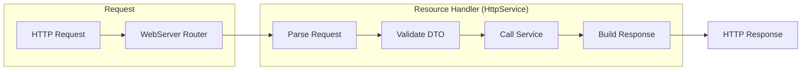
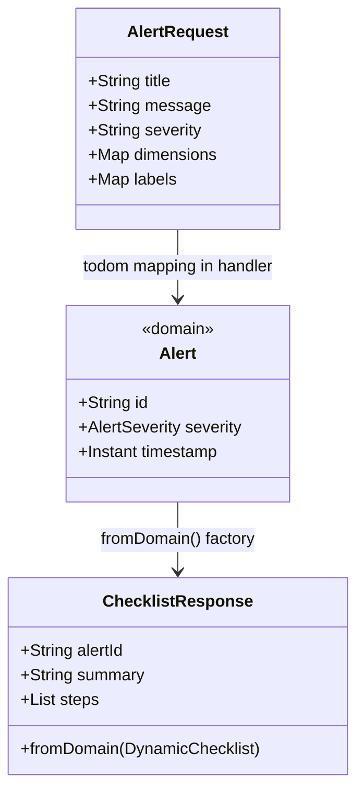
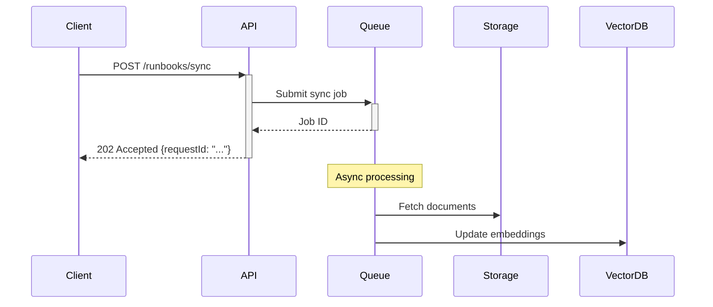

# REST API Design

## Overview

This document captures architectural reasoning for the REST API layer implementation in Runbook-Synthesizer.

## API Design Principles

### RESTful Resource Naming
Following REST conventions from DESIGN.md section 4:
- `/api/v1/alerts` - Alert ingestion (verb on noun)
- `/api/v1/runbooks/sync` - Runbook synchronization (action on resource)
- `/api/v1/webhooks` - Webhook configuration (resource collection)
- `/api/v1/health` - Health status (system resource)

### Versioning Strategy
- URL path versioning (`/api/v1/...`) for explicit version control
- Allows future `/api/v2/...` without breaking existing clients
- Version corresponds to API contract, not application version

## Handler Architecture

### Helidon SE 4.x Pattern



### HttpService Interface
Each resource implements `io.helidon.webserver.http.HttpService`:

```java
public class AlertResource implements HttpService {
    
    @Override
    public void routing(HttpRules rules) {
        rules.post("/", this::handlePost);
    }
    
    private void handlePost(ServerRequest req, ServerResponse res) {
        // Handler implementation
    }
}
```

### Dependency Injection Strategy
For v1.0, use constructor injection with manual wiring in `RunbookSynthesizerApp`:

```java
// In RunbookSynthesizerApp.configureRouting()
var checklistService = new StubChecklistService();
routing.register("/api/v1/alerts", new AlertResource(checklistService));
```

Future phases may introduce Helidon Inject or other DI frameworks.

## DTO Design

### Request/Response Pattern



### Immutable Records
All DTOs are Java records for:
- Immutability (thread-safe)
- Automatic equals/hashCode/toString
- Compact syntax
- JSON-P friendly serialization

### Validation Strategy
Compact constructors with `Objects.requireNonNull()` and explicit checks:

```java
public record AlertRequest(String title, String severity, ...) {
    public AlertRequest {
        Objects.requireNonNull(title, "title is required");
        Objects.requireNonNull(severity, "severity is required");
    }
}
```

## Error Handling

### Standardized Error Response

```json
{
  "correlationId": "uuid-string",
  "errorCode": "VALIDATION_ERROR",
  "message": "Request validation failed",
  "timestamp": "2024-01-16T00:00:00Z",
  "details": {
    "title": "cannot be null",
    "severity": "must be one of: CRITICAL, WARNING, INFO"
  }
}
```

### Error Code Taxonomy
| Code | HTTP Status | Description |
|------|-------------|-------------|
| VALIDATION_ERROR | 400 | Request body validation failed |
| NOT_FOUND | 404 | Resource not found |
| CONFLICT | 409 | Resource already exists |
| INTERNAL_ERROR | 500 | Unexpected server error |
| SERVICE_UNAVAILABLE | 503 | Dependent service unavailable |

### Exception Mapping
Handlers catch specific exceptions and map to error responses:

```java
try {
    var result = service.process(request);
    res.send(result);
} catch (ValidationException e) {
    res.status(Status.BAD_REQUEST_400)
       .send(ErrorResponse.validation(e.getErrors()));
} catch (Exception e) {
    res.status(Status.INTERNAL_SERVER_ERROR_500)
       .send(ErrorResponse.internal(e));
}
```

## JSON Serialization

### Helidon 4.x Media Support
Using `helidon-webserver-media-jsonp` for JSON-P integration:

```xml
<dependency>
    <groupId>io.helidon.webserver</groupId>
    <artifactId>helidon-webserver-media-jsonp</artifactId>
</dependency>
```

### Record Serialization
Java records serialize naturally to JSON via:
- Jackson integration (if added)
- JSON-B (Jakarta JSON Binding)
- Manual JsonObject building

For v1.0, start with manual JsonObject for explicit control, migrate to JSON-B if complexity grows.

## Async Considerations

### Runbook Sync Endpoint
The `/api/v1/runbooks/sync` endpoint triggers async document processing:



Returns 202 Accepted immediately with request ID for tracking.

## Testing Strategy

### Unit Tests
Each resource class tested in isolation:
- Mock service dependencies
- Test request parsing and validation
- Test response serialization
- Test error handling paths

### Integration Tests
`ApiRoutingIntegrationTest` boots the server and tests:
- Full request/response cycle
- Content-type negotiation
- Route registration

### Test Utilities
Use Helidon testing support:

```java
@HelidonTest
class AlertResourceTest {
    @Inject
    WebTarget target;
    
    @Test
    void testPostAlert() {
        var response = target.path("/api/v1/alerts")
            .request()
            .post(Entity.json(alertRequest));
        assertThat(response.getStatus(), is(200));
    }
}
```

## Security Notes (Future)

### OCI IAM Integration (Phase 4)
Future authentication will use OCI Instance Principal or Resource Principal:
- Add `Authorization` header validation
- Integrate with OCI IAM SDK
- RBAC based on OCI policies

### Input Sanitization
Even in v1.0, protect against:
- JSON injection (handled by parser)
- Oversized payloads (Helidon content-length limits)
- Resource exhaustion (rate limiting deferred to v1.1)
