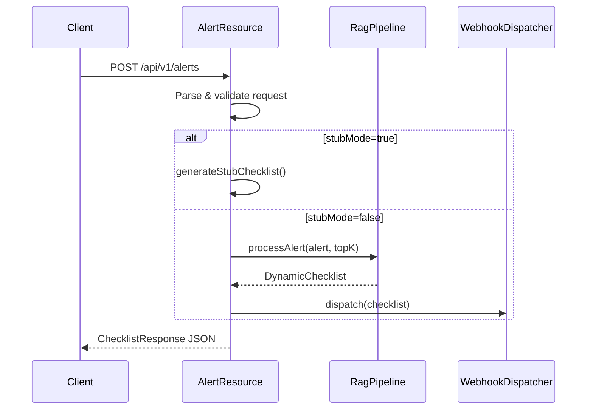

# Design: Wire AlertResource to RAG Pipeline

## Context
`AlertResource` is the HTTP handler for `POST /api/v1/alerts`. It currently returns hardcoded stub data, which was useful during initial API scaffolding but now blocks E2E testing and production use. The RAG pipeline components (`RagPipelineService`, `WebhookDispatcher`) are fully implemented and tested in isolation - they just need to be wired into the HTTP layer.

**Stakeholders**: API consumers, integration testers, production deployment.

**Constraints**:
- Maintain backwards compatibility for existing unit tests
- Preserve ability to run in "stub mode" for isolated testing
- Follow existing Helidon SE 4.x patterns in the codebase

## Goals / Non-Goals
- **Goals**:
  - Enable real RAG pipeline execution from HTTP endpoint
  - Dispatch generated checklists to configured webhooks
  - Support mode switching via configuration
  - Maintain test isolation capabilities
  
- **Non-Goals**:
  - Authentication/authorization (not in v1.0 scope)
  - Rate limiting
  - Circuit breaker patterns (future enhancement)

## Decisions

### 1. Constructor Injection for Dependencies
**Decision**: Use constructor injection for `RagPipelineService` and `WebhookDispatcher`.

**Rationale**: Follows existing patterns in the codebase (see `RagPipelineService` constructor). Makes dependencies explicit and testable.

**Alternatives considered**:
- Service locator pattern → Rejected: harder to test, implicit dependencies
- Factory pattern → Rejected: over-engineering for current needs

### 2. Mode Configuration via Constructor Flag
**Decision**: Add an optional `stubMode` boolean to AlertResource constructor.

```java
public AlertResource(RagPipelineService ragPipeline, 
                     WebhookDispatcher webhookDispatcher,
                     boolean stubMode) {
  // ...
}

// Convenience constructor for backward compatibility in tests
public AlertResource() {
  this(null, null, true);  // Stub mode
}
```

**Rationale**: 
- Allows gradual migration of tests
- No-arg constructor keeps existing test patterns working
- Explicit flag is self-documenting

**Alternatives considered**:
- Environment variable → Rejected: harder to control in unit tests
- Config object injection → Rejected: over-engineering for single boolean

### 3. Async Pipeline with Sync HTTP Response
**Decision**: Use `CompletableFuture.join()` to block until pipeline completes, then return response.

**Rationale**: 
- HTTP clients expect synchronous response with checklist
- Pipeline latency target is <5s (per project.md)
- Virtual threads in Helidon SE 4.x handle blocking efficiently

**Alternatives considered**:
- Async response with polling → Rejected: complicates client integration
- WebSocket streaming → Rejected: out of scope for v1.0

### 4. Webhook Dispatch Fire-and-Forget
**Decision**: Dispatch webhooks asynchronously after returning HTTP response.

```java
// Return checklist to HTTP caller first
res.send(toJson(checklistResponse));

// Then dispatch to webhooks (fire-and-forget)
webhookDispatcher.dispatch(dynamicChecklist);
```

**Rationale**: 
- HTTP caller gets immediate response
- Webhook failures don't block HTTP response
- Webhook retry logic is already handled in `RetryingWebhookDispatcher`

## Component Interaction



## Risks / Trade-offs

| Risk | Mitigation |
|------|------------|
| RagPipelineService throws exception | Catch and return 500 with error details |
| WebhookDispatcher unavailable | Fire-and-forget; logged but doesn't fail HTTP |
| Tests break with new constructor | Provide backward-compatible no-arg constructor |

## Open Questions
- Should webhook dispatch failures be exposed in response? (Deferred to future enhancement)
- Do we need a separate timeout configuration for the pipeline? (Use existing Helidon request timeout for now)
