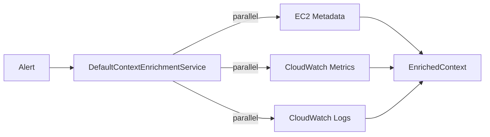
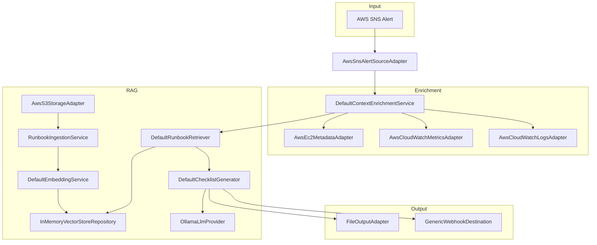

# Design: Wire E2E Pipeline for AWS

## Context

The Runbook-Synthesizer application has all individual AWS adapters implemented but lacks the "glue" that connects them into a working end-to-end pipeline. The current state:

- **Alert Ingestion**: `AwsSnsAlertSourceAdapter` ✅
- **Storage**: `AwsS3StorageAdapter` ✅
- **Metrics**: `AwsCloudWatchMetricsAdapter` ✅
- **Logs**: `AwsCloudWatchLogsAdapter` ✅
- **LLM**: `OllamaLlmProvider` (MVP), `AwsBedrockLlmProvider` (future) ✅
- **Context Enrichment**: Interface only, no implementation ❌
- **Vector Store**: `OracleVectorStoreRepository` (requires Oracle 23ai) ⚠️
- **Runbook Ingestion**: Not implemented ❌
- **File Output**: Not implemented ❌
- **Production Wiring**: App runs in stub mode ❌

## Goals / Non-Goals

### Goals
- Enable complete E2E testing with AWS + local Ollama LLM
- Provide abstraction for vector stores (local → oracle → aws in future)
- Implement minimal runbook ingestion with semantic chunking
- Simple file output for MVP validation
- Wire production app with real dependencies

### Non-Goals
- AWS-native vector store (deferred to future)
- Oracle 23ai vector store testing (deferred)
- Webhook integrations (Slack, PagerDuty)
- Advanced chunking strategies
- Multi-document summarization

## Decisions

### 1. Vector Store Abstraction

**Decision:** Follow `CloudStorageAdapter` pattern with interface in `infrastructure/cloud/` and provider-specific implementations in subdirectories.

**Rationale:**
- Consistent with existing adapter patterns (`CloudStorageAdapter`, `ComputeMetadataAdapter`)
- The `CloudAdapterFactory` already handles provider switching
- Allows seamless switching between local, OCI, and AWS vector stores

**Package Structure:**
```
infrastructure/cloud/
├── VectorStoreRepository.java        # Interface (moved from rag/)
├── local/
│   └── InMemoryVectorStoreRepository.java
├── oci/
│   └── OracleVectorStoreRepository.java   # Moved from rag/
└── aws/
    └── AwsOpenSearchVectorStoreRepository.java  # Stub for future
```

**Configuration:**
```yaml
vectorStore:
  provider: local  # 'local', 'oci', or 'aws'
  local:
    persistPath: null  # optional file persistence
  oci:
    # uses existing Oracle 23ai connection
  aws:
    region: us-west-2
    indexName: runbook-synthesizer
```

### 2. Context Enrichment Implementation

**Decision:** Create `DefaultContextEnrichmentService` that orchestrates existing adapters

**Rationale:**
- All adapters exist, just need orchestration
- Use `CompletableFuture.allOf()` to parallelize metadata/metrics/logs
- Inject adapters via constructor for testability



### 3. Runbook Ingestion Strategy

**Decision:** Create `RunbookIngestionService` with simple markdown chunking

**Approach:**
1. Fetch markdown files from S3 via `CloudStorageAdapter`
2. Parse YAML frontmatter for metadata (tags, shapes)
3. Split by H2/H3 headers (preserving procedure boundaries)
4. Generate embeddings via `EmbeddingService`
5. Store in vector store

**Chunking rules:**
- Each H2/H3 section becomes a chunk
- Min chunk size: 100 chars
- Max chunk size: 2000 chars
- Preserve code blocks as atomic units

### 4. File Output Adapter

**Decision:** Create `FileOutputAdapter implements WebhookDestination`

**Rationale:**
- Fits existing webhook dispatcher pattern
- Simple JSON/Markdown output to configurable path
- Easy to validate in E2E tests

```yaml
output:
  file:
    enabled: true
    path: ${OUTPUT_PATH:./output}
    format: json  # or 'markdown'
```

### 5. Production Wiring

**Decision:** Remove stub mode from `RunbookSynthesizerApp`

**Approach:**
1. Create dependency injection helper class `ServiceFactory`
2. Instantiate real services in non-stub mode
3. Keep stub mode available for simple testing
4. Add `app.real-mode: true` configuration flag

## Risks / Trade-offs

| Risk | Impact | Mitigation |
|------|--------|------------|
| In-memory vector store loses data on restart | Low (MVP only) | Add optional file persistence |
| Simple chunking may miss context boundaries | Medium | Document limitations, improve in v2 |
| Ollama dependency for local testing | Low | Document setup requirements |

## Component Architecture



## Open Questions

1. **File output format:** Should we output JSON (machine-readable) or Markdown (human-readable) by default?
   - **Proposed:** JSON for E2E validation, Markdown as optional

2. **Runbook sync trigger:** Should we implement S3 event-based sync for MVP?
   - **Proposed:** No, manual sync via REST API is sufficient for MVP
