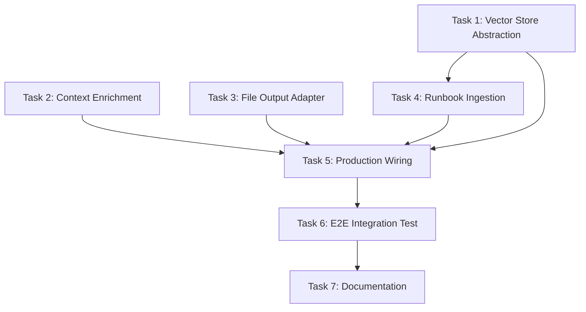

# Tasks: Wire E2E Pipeline for AWS

## Task 1: Implement Vector Store Abstraction

**Description:** Create `InMemoryVectorStoreRepository` and `VectorStoreFactory` to enable vector store switching.

### Subtasks
- [ ] 1.1 Move `VectorStoreRepository.java` interface to `infrastructure/cloud/`
  - Follows same pattern as `CloudStorageAdapter`
  - Add `providerType()` method for consistency
- [ ] 1.2 Create `InMemoryVectorStoreRepository.java` in `infrastructure/cloud/local/`
  - Implements `VectorStoreRepository` interface
  - Uses `ConcurrentHashMap` for thread-safe storage
  - Implements cosine similarity search with manual calculation
  - Returns `providerType()` as `"local"`
- [ ] 1.3 Move `OracleVectorStoreRepository.java` to `infrastructure/cloud/oci/`
  - Update package and imports
  - Returns `providerType()` as `"oci"`
- [ ] 1.4 Create `AwsOpenSearchVectorStoreRepository.java` stub in `infrastructure/cloud/aws/`
  - Returns `providerType()` as `"aws"`
  - Implementation deferred (throws `UnsupportedOperationException`)
- [ ] 1.5 Update `CloudAdapterFactory.java` to add `getVectorStoreClass()` method
  - Supports `local`, `oci`, `aws` providers
  - Returns appropriate `VectorStoreRepository` implementation class
- [ ] 1.6 Create unit tests `InMemoryVectorStoreRepositoryTest.java`
- [ ] 1.7 Update `CloudAdapterFactoryTest.java` with vector store tests

### Verification Steps
```bash
cd c:\Users\bwend\repos\ops-scribe
mvn test -Dtest=InMemoryVectorStoreRepositoryTest -q
mvn test -Dtest=CloudAdapterFactoryTest -q
```
**Expected:** All unit tests pass.

### Acceptance Criteria
- [ ] `VectorStoreRepository` interface in `infrastructure/cloud/` with `providerType()` method
- [ ] `InMemoryVectorStoreRepository` in `infrastructure/cloud/local/` with full implementation
- [ ] `OracleVectorStoreRepository` in `infrastructure/cloud/oci/` (moved from rag/)
- [ ] `AwsOpenSearchVectorStoreRepository` stub in `infrastructure/cloud/aws/`
- [ ] `CloudAdapterFactory.getVectorStoreClass()` returns correct class for `local`, `oci`, `aws`
- [ ] Cosine similarity search returns correctly ranked results
- [ ] Unit tests cover: store, storeBatch, search, delete, factory selection for all providers

---

## Task 2: Implement DefaultContextEnrichmentService

**Description:** Create production implementation of `ContextEnrichmentService` that orchestrates AWS adapters.

### Subtasks
- [ ] 2.1 Create `DefaultContextEnrichmentService.java` in `enrichment/`
  - Inject `ComputeMetadataAdapter`, `MetricsSourceAdapter`, `LogSourceAdapter`
  - Implement `enrich()` using `CompletableFuture.allOf()` for parallelization
  - Handle partial failures gracefully (if metrics fail, still return logs)
- [ ] 2.2 Create unit tests `DefaultContextEnrichmentServiceTest.java`
  - Test parallel execution
  - Test partial failure handling
  - Test with mock adapters

### Verification Steps
```bash
cd c:\Users\bwend\repos\ops-scribe
mvn test -Dtest=DefaultContextEnrichmentServiceTest -q
```
**Expected:** All unit tests pass.

### Acceptance Criteria
- [ ] `DefaultContextEnrichmentService` implements `ContextEnrichmentService` interface
- [ ] Fetches EC2 metadata, CloudWatch metrics, and logs in parallel
- [ ] Returns `EnrichedContext` with all available data
- [ ] Gracefully handles adapter failures (logs error, continues with partial data)
- [ ] Unit tests cover: success case, partial failure, complete failure

---

## Task 3: Implement FileOutputAdapter

**Description:** Create file-based output adapter for MVP validation.

### Subtasks
- [ ] 3.1 Create `FileOutputAdapter.java` in `output/adapters/`
  - Implements `WebhookDestination` interface
  - Outputs JSON format by default
  - Configurable output directory
  - Filename format: `checklist-{alertId}-{timestamp}.json`
- [ ] 3.2 Create `FileOutputConfig.java` record
- [ ] 3.3 Update `application.yaml` with file output configuration
- [ ] 3.4 Create unit tests `FileOutputAdapterTest.java`

### Verification Steps
```bash
cd c:\Users\bwend\repos\ops-scribe
mvn test -Dtest=FileOutputAdapterTest -q
```
**Expected:** All unit tests pass.

### Acceptance Criteria
- [ ] `FileOutputAdapter` implements `WebhookDestination` interface
- [ ] Writes `DynamicChecklist` as JSON to configured directory
- [ ] Creates directory if it doesn't exist
- [ ] `send()` returns `WebhookResult.success()` on successful write
- [ ] `send()` returns `WebhookResult.failure()` on IO error
- [ ] Unit tests cover: success write, directory creation, error handling

---

## Task 4: Implement RunbookIngestionService

**Description:** Create service to ingest runbooks from S3, chunk them, and store in vector store.

### Subtasks
- [ ] 4.1 Create `RunbookChunker.java` in `rag/`
  - Parse YAML frontmatter for metadata
  - Split by H2/H3 headers
  - Preserve code blocks as atomic units
  - Min/max chunk size constraints
- [ ] 4.2 Create `RunbookIngestionService.java` in `rag/`
  - Fetch runbook content via `CloudStorageAdapter`
  - Use `RunbookChunker` to create chunks
  - Generate embeddings via `EmbeddingService`
  - Store chunks in `VectorStoreRepository`
- [ ] 4.3 Create unit tests `RunbookChunkerTest.java`
- [ ] 4.4 Create unit tests `RunbookIngestionServiceTest.java`

### Verification Steps
```bash
cd c:\Users\bwend\repos\ops-scribe
mvn test -Dtest=RunbookChunkerTest -q
mvn test -Dtest=RunbookIngestionServiceTest -q
```
**Expected:** All unit tests pass.

### Acceptance Criteria
- [ ] `RunbookChunker` extracts YAML frontmatter (title, tags, applicable_shapes)
- [ ] `RunbookChunker` splits content into semantic chunks preserving headers
- [ ] `RunbookChunker` respects min/max chunk size constraints
- [ ] `RunbookIngestionService.ingest(path)` fetches from S3 and stores chunks
- [ ] `RunbookIngestionService.ingestAll()` processes all `.md` files in bucket
- [ ] Unit tests cover: frontmatter parsing, chunking, embedding, storage

---

## Task 5: Wire Production RagPipelineService

**Description:** Replace stub mode with real pipeline in `RunbookSynthesizerApp`.

### Subtasks
- [ ] 5.1 Create `ServiceFactory.java` in `config/`
  - Factory to create all production services
  - Reads configuration and instantiates appropriate adapters
  - Wires dependencies correctly
- [ ] 5.2 Update `RunbookSynthesizerApp.java`
  - Remove stub mode fallback for real mode
  - Use `ServiceFactory` to create `RagPipelineService`
  - Wire `AlertResource` with real `RagPipelineService` and `WebhookDispatcher`
- [ ] 5.3 Update `application.yaml` with new configuration options
  - Add `vectorStore.provider: local`
  - Add `output.file.enabled: true`
  - Add `app.real-mode: true` flag
- [ ] 5.4 Create integration test `ProductionWiringIT.java`

### Verification Steps
```bash
# Run unit tests
cd c:\Users\bwend\repos\ops-scribe
mvn test -Dtest=ServiceFactoryTest -q

# Run full test suite to ensure no regressions
mvn test -q
```
**Expected:** All tests pass.

### Acceptance Criteria
- [ ] `ServiceFactory` correctly instantiates all required services
- [ ] `RunbookSynthesizerApp` starts in real mode when configured
- [ ] Alert endpoint processes alerts through real `RagPipelineService`
- [ ] Checklists are dispatched to configured webhooks (including file output)
- [ ] Existing tests continue to pass (no regressions)

---

## Task 6: E2E Integration Tests

**Description:** Create end-to-end tests that validate the complete flow. Two separate test suites: LocalStack (for CI/local) and real AWS services.

### Subtask 6A: LocalStack E2E Test

- [ ] 6A.1 Create `LocalStackE2EPipelineIT.java` in `integration/e2e/`
  - Uses LocalStack for AWS services (S3, CloudWatch Logs, CloudWatch Metrics)
  - Uses Ollama container for LLM
  - Seeds runbook chunks in in-memory vector store
  - Sends test alert and verifies file output
- [ ] 6A.2 Create test fixtures:
  - Sample runbooks in `src/test/resources/sample-runbooks/`
  - Sample CloudWatch alarm JSON

**Verification (LocalStack):**
```bash
# Ensure Docker is running
docker ps

cd c:\Users\bwend\repos\ops-scribe
mvn test -Dtest=LocalStackE2EPipelineIT -q
```
**Expected:** E2E test passes with LocalStack containers, checklist file is created.

**Acceptance Criteria (LocalStack):**
- [ ] E2E test starts LocalStack container with S3 and CloudWatch
- [ ] E2E test starts Ollama container with required models
- [ ] E2E test ingests sample runbooks from S3
- [ ] E2E test sends CloudWatch alarm and receives checklist
- [ ] File output contains valid `DynamicChecklist` JSON
- [ ] Generated checklist references seeded runbook content

---

### Subtask 6B: Real AWS E2E Test

- [ ] 6B.1 Create `AwsCloudE2EPipelineIT.java` in `integration/e2e/`
  - Extends `RealAwsTestBase` (requires AWS credentials)
  - Uses real AWS S3, CloudWatch Logs, CloudWatch Metrics
  - Uses Ollama container for LLM (local)
  - Provisions test resources via existing CDK infrastructure
- [ ] 6B.2 Add E2E resources to CDK stack (if not already present)
  - S3 bucket for test runbooks
  - CloudWatch log group for test logs
- [ ] 6B.3 Create separate Maven profile `aws-e2e-cloud`

**Verification (Real AWS):**
```bash
# Deploy CDK infrastructure first
cd c:\Users\bwend\repos\ops-scribe\infra\cdk
cdk deploy --require-approval never

# Run real AWS E2E test (requires AWS credentials)
cd c:\Users\bwend\repos\ops-scribe
mvn test -Dtest=AwsCloudE2EPipelineIT -Paws-e2e-cloud -Daws-e2e=true -q
```
**Expected:** E2E test passes against real AWS services, checklist file is created.

**Acceptance Criteria (Real AWS):**
- [ ] E2E test runs only when `-Daws-e2e=true` is set
- [ ] E2E test uses real AWS S3 for runbook storage
- [ ] E2E test uses real CloudWatch for metrics/logs enrichment
- [ ] E2E test uses local Ollama for LLM (not Bedrock)
- [ ] File output contains valid `DynamicChecklist` JSON
- [ ] Test cleans up or reuses CDK-provisioned resources

---

### Subtask 6C: Documentation

- [ ] 6C.1 Document E2E test setup in `docs/TESTING.md`
  - LocalStack test instructions
  - Real AWS test instructions
  - CDK deployment requirements

**Verification (6C):**
```bash
# Manual review of documentation
cat docs/TESTING.md
```
**Expected:** Documentation is clear and complete.

**Acceptance Criteria (6C):**
- [ ] `docs/TESTING.md` includes LocalStack setup instructions
- [ ] `docs/TESTING.md` includes real AWS test instructions
- [ ] CDK deployment prerequisites are documented

---

### Subtask 6D: Manual Alarm Trigger Tests

**Description:** Provide demo-ready tests that manually trigger alarms through multiple channels.

- [ ] 6D.1 Create `ManualAlarmTriggerIT.java` in `integration/e2e/`
  - Test `shouldTriggerAlarmViaHttpPost`: Direct HTTP POST to `/api/v1/alerts`
  - Test `shouldTriggerAlarmViaSnsPayload`: Parse SNS-wrapped CloudWatch alarm
  - Test `shouldTriggerAlarmWithOciPayload`: Parse OCI Monitoring Alarm format
  - Test `shouldTriggerAlarmWithMinimalPayload`: Minimal required fields only
- [ ] 6D.2 Create `AlertTriggerHelper.java` in `integration/e2e/`
  - `createCloudWatchAlarm(alarmName, metric, threshold)` — factory for CloudWatch alarms
  - `createOciMonitoringAlarm(alarmName, resourceOcid)` — factory for OCI alarms
  - `wrapInSnsEnvelope(alert)` — wrap alert in SNS message envelope
  - `parseFromSnsMessage(snsMessage)` — extract alert from SNS wrapper
- [ ] 6D.3 Create sample alarm JSON fixtures in `src/test/resources/sample-alarms/`
  - `cloudwatch-high-memory.json`
  - `cloudwatch-high-cpu.json`
  - `sns-wrapped-alarm.json`
  - `oci-monitoring-alarm.json`
- [ ] 6D.4 Create `scripts/demo-e2e-pipeline.ps1` PowerShell demo script
  - Accepts `-AlertType` (`memory`, `cpu`, `disk`) and `-Severity` parameters
  - Sends alarm via HTTP POST to local server
  - Waits for pipeline completion
  - Displays generated checklist summary

**Verification (6D):**
```powershell
# Run manual trigger tests
cd c:\Users\bwend\repos\ops-scribe
mvn test -Dtest=ManualAlarmTriggerIT -q

# Test demo script (requires running server)
.\scripts\demo-e2e-pipeline.ps1 -AlertType memory -Severity warning
```
**Expected:** All trigger tests pass, demo script successfully invokes pipeline.

**Acceptance Criteria (6D):**
- [ ] HTTP POST to `/api/v1/alerts` triggers pipeline processing
- [ ] SNS-wrapped CloudWatch alarms are correctly parsed
- [ ] OCI Monitoring alarms are correctly parsed
- [ ] `AlertTriggerHelper` creates valid alarm payloads for all formats
- [ ] Demo script successfully sends alarm and displays checklist output
- [ ] All sample alarm fixtures are valid JSON

---

### Subtask 6E: Full Pipeline Integration Tests

**Description:** Test the complete flow from alert ingestion through checklist output.

- [ ] 6E.1 Create `FullPipelineE2EIT.java` in `integration/e2e/`
  - Test `shouldProcessHighMemoryAlert_FullPipeline`: Memory alert → enrichment → RAG → checklist → file
  - Test `shouldProcessHighCpuAlert_FullPipeline`: CPU alert with different runbook retrieval
  - Test `shouldProcessCriticalAlertWithUrgentSteps`: Critical severity gets prioritized steps
  - Test `shouldEnrichContextWithMetrics`: Verify CloudWatch metrics appear in context
  - Test `shouldEnrichContextWithLogs`: Verify CloudWatch logs appear in context
  - Test `shouldRetrieveRelevantRunbookChunks`: Verify semantic similarity retrieval works
  - Test `shouldGenerateChecklistWithLlm`: Verify LLM generates coherent checklist
  - Test `shouldDispatchToMultipleWebhooks`: Verify fanout to multiple destinations
  - Test `shouldWriteOutputToFile`: Verify file output adapter writes correctly
  - Test `shouldHandlePartialEnrichmentFailure`: Metrics fail but logs succeed → partial context
  - Test `shouldTimeoutGracefully`: Long-running LLM call times out cleanly
- [ ] 6E.2 Create `PipelineTestHarness.java` in `integration/e2e/`
  - `localStack(container)` — factory for LocalStack mode
  - `realAws(base)` — factory for real AWS mode
  - `processAlert(alert)` — executes full pipeline, returns checklist
  - `getOutputFile(alertId)` — returns path to generated output file
  - `seedRunbooks(paths)` — seeds vector store with sample runbooks
- [ ] 6E.3 Create sample runbooks in `src/test/resources/sample-runbooks/`
  - `memory-troubleshooting.md` — memory alert scenarios
  - `cpu-troubleshooting.md` — CPU alert scenarios
  - `disk-troubleshooting.md` — disk space alert scenarios
  - `network-troubleshooting.md` — network latency scenarios

**Verification (6E):**
```powershell
# Run full pipeline tests (LocalStack mode)
cd c:\Users\bwend\repos\ops-scribe
mvn test -Dtest=FullPipelineE2EIT -q

# Run full pipeline tests (Real AWS mode)
mvn test -Dtest=FullPipelineE2EIT -Pe2e-aws-cloud -q
```
**Expected:** All pipeline tests pass, checklists generated for each alert type.

**Acceptance Criteria (6E):**
- [ ] Memory alerts produce checklists with memory-related steps
- [ ] CPU alerts produce checklists with CPU-related steps
- [ ] Critical alerts have higher-priority steps than WARNING alerts
- [ ] Context enrichment includes real metrics (or mocked for LocalStack)
- [ ] Context enrichment includes real logs (or mocked for LocalStack)
- [ ] RAG retrieval returns semantically relevant chunks
- [ ] LLM generates checklist with at least 3 actionable steps
- [ ] Webhook dispatch returns success for all configured destinations
- [ ] File output creates valid JSON file
- [ ] Partial failures don't crash pipeline (graceful degradation)
- [ ] Timeouts are handled without hanging

---

### Subtask 6F: Output File Validation Tests

**Description:** Ensure generated checklist files are valid and actionable.

- [ ] 6F.1 Create `OutputFileValidationIT.java` in `integration/e2e/`
  - Test `shouldOutputValidJsonSchema`: File parses as valid JSON matching `DynamicChecklist` schema
  - Test `shouldContainAlertIdInFilename`: Filename includes alert ID for traceability
  - Test `shouldContainTimestampInFilename`: Filename includes generation timestamp
  - Test `shouldHaveNonEmptySteps`: Steps list is not empty
  - Test `shouldHaveValidStepOrdering`: Steps have sequential order numbers (1, 2, 3...)
  - Test `shouldIncludeSourceRunbooks`: Source runbooks list is populated
  - Test `shouldIncludeLlmProviderUsed`: LLM provider field is set (e.g., "ollama")
  - Test `shouldHaveCommandsInSteps`: At least some steps have executable commands
  - Test `shouldReferenceSeededContent`: Generated steps reference seeded runbook content
  - Test `shouldBeReadableByExternalTools`: File can be parsed by `jq` (JSON query tool)
- [ ] 6F.2 Create `ChecklistSchemaValidator.java` in `integration/e2e/`
  - `validate(path)` — returns validation result for a checklist file
  - `hasExpectedFields(checklist)` — checks for required fields
  - `findMissingFields(checklist)` — returns list of missing required fields
  - `validateStepOrdering(checklist)` — ensures steps are sequential
- [ ] 6F.3 Create JSON schema file `src/test/resources/schemas/dynamic-checklist.schema.json`

**Verification (6F):**
```powershell
# Run output validation tests
cd c:\Users\bwend\repos\ops-scribe
mvn test -Dtest=OutputFileValidationIT -q

# Manual validation with jq (requires jq installed)
Get-ChildItem output\checklist-*.json | ForEach-Object { jq . $_.FullName }
```
**Expected:** All validation tests pass, output files conform to schema.

**Acceptance Criteria (6F):**
- [ ] Output files parse as valid JSON
- [ ] Filenames follow pattern `checklist-{alertId}-{timestamp}.json`
- [ ] `alertId` field matches the triggering alert
- [ ] `steps` array is non-empty
- [ ] `steps[].order` values are sequential
- [ ] `sourceRunbooks` array contains at least one runbook path
- [ ] `llmProviderUsed` is set to an expected provider ID
- [ ] At least 50% of steps have non-empty `commands` arrays
- [ ] JSON schema validation passes
- [ ] External tools (`jq`) can parse the output

---

## Task 7: Documentation

**Description:** Update documentation to reflect new components and E2E testing.

### Subtasks
- [ ] 7.1 Update `docs/ARCHITECTURE.md` with vector store abstraction
- [ ] 7.2 Create `docs/TESTING.md` with E2E test setup guide
- [ ] 7.3 Update `README.md` with E2E quickstart

### Verification Steps
Manual review of documentation accuracy.

### Acceptance Criteria
- [ ] `docs/ARCHITECTURE.md` documents `VectorStoreFactory` and `InMemoryVectorStoreRepository`
- [ ] `docs/TESTING.md` explains how to run E2E tests locally
- [ ] `README.md` includes quickstart for local E2E testing

---

## Dependency Graph



## Parallelization

- **Parallel:** Tasks 1, 2, 3 can be implemented in parallel (no dependencies)
- **Sequential:** Task 4 depends on Task 1 (vector store)
- **Sequential:** Task 5 depends on Tasks 1-4 completion
- **Sequential:** Tasks 6, 7 are sequential
